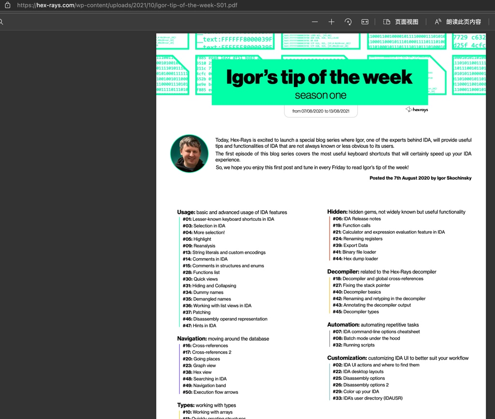
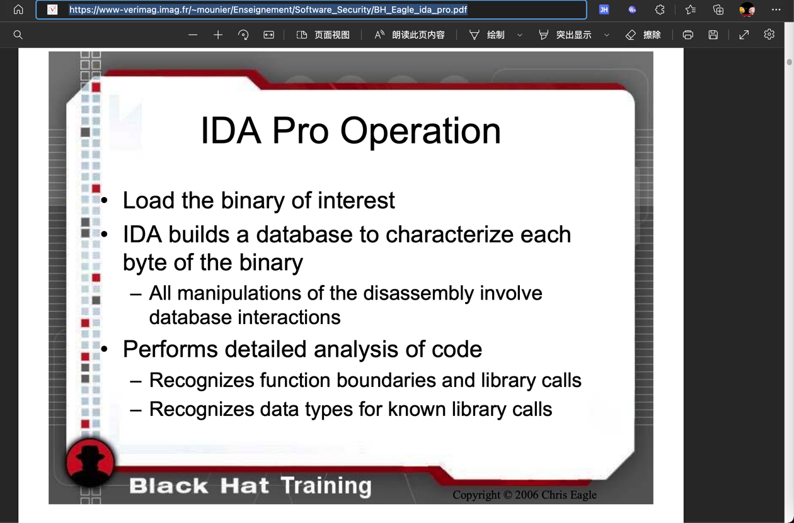

# 文档和资料

TODO：

* 【整理】学习IDA教程：The IDA Pro Book

---

此处整理IDA相关的文档、教程、书籍等有价值的参考资料。

## IDA的tip of week

[tip of week index (hex-rays.com)](https://hex-rays.com/wp-content/uploads/2021/10/igor-tip-of-the-week-S01.pdf)

有很多有用提示

有空可以看看

## IDA官网的下载中心

IDA官网的下载中心：

[Download center (hex-rays.com)](https://hex-rays.com/download-center/)

有很多相关内容，可供学习和使用：

* SDK and Utilities
  * Some downloads are only available to IDA Pro users and require a password which can be found in the latest download email.
  * IDA SDK 7.7
    * Develop processor modules, loaders and extensions - extended with the source of 30+ modules and 20+ loaders.
    * Please check out the SDK documentation online (or download the zip file for offline use).
  * Flair 7.7
    * Add your own compiler libraries to the FLIRT engine
  * IDAClang 7.7
    * A type library generator based on libclang. Use this when parsing complex C++ code that tilib cannot handle.
  * Tilib 7.7
    * Create your own type libraries
  * Loadint 7.7
    * Create your own disassembler comment databases
  * idsutils 7.7
    * Create your own IDS files from DLLs
  * ios_deploy
    * iOS helper utility to manipulate iOS devices
  * PIN tool
    * The source code of our PIN tool. It creates a debugger backend out of Intel's PIN framework
    * See: PIN framework
  * TVision 2015 library
    * For the IDA text interface (source code)
  * Qwingraph v1.10
    * Source code the Wingraph we use and modified (GPL)
* Sample plugins
  * Stealth
    * Stealth against anti-debugging tricks
  * findcrypt
    * Identifies some frequently used block ciphers
  * highlighter
    * Highlights code that has been single stepped through in a debugging session
  * unispector
    * Extracts unicode strings from an IDA database
  * IDA Pro, Python and Qt
  * Migrating PySide code to PyQt5
  * Using custom viewers from IDAPython
  * Augmenting IDA UI with your own actions
  * Plugin contest pages
    * Our plugins contest pages offer many useful plugins!
    * By year: 2009, 2010, 2011, 2012, 2013, 2014, 2015, 2016, 2017, 2018, 2019
* User contributions
  * Plugins
    * COM Interface Plugin
      * By Dieter Spaar
    * Sobek
      * A simple data-flow analysis plugin by JF Michel
    * PDBPlus
      * By Dean Ashton
    * IDB_2_PAT
      * By J.C Roberts
    * strucrec
      * By Halvar Flake
    * Class Informer plugin
      * To reconstruct C++ classes using the RTTI info
      * By Sirmabus
  * IDC scripts
    * Visual Basic Disassembly IDC script
      * To assist in the disassembly of VB5/VB6 hostile code
      * By Reginald Wong
    * IDC Delphi script
      * Delphi constants and class definitions
      * By Dietrich Teickner
    * h2enum
      * converts C/C++ header files to IDA enums - Nice if you have no TIL files
      * By Leonid Lisovsky
    * IDC PDR script
      * Useful in the analysis of PDR files (port drivers)
      * By Huang Yu
    * Loader script
      * For VC++ and Borland C++
      * By Toshiyuki Tega
    * Microchipss 16F84 PIC script
      * Defines SFR and bit names for Microchip's 16F84 PIC processor but can be used as a template for other processors
      * By an anonymous contributor
    * dumpinfo
      * By JC Roberts
    * Pentica-B script
      * Pentica-B import script for the H8-8300
      * By Tom Hayes
    * H8 script
      * Improves the inital H8 autoanalysis
      * By Tom Hayes
  * Processor modules
    * AMD 29K processor module
      * By Arne Wichmann
    * NEC V830 processor module
      * By Ben Byer
    * Samsung SAM8
      * By Andrew de Quincey. Also available is a plugin that generates files compatible with the SAMA assembler.
  * Miscellaneous
    * symload
      * By Dainis Jonitis
    * PE utilities
      * A set of extremely useful PE utilities
      * By Atli Mar Gudmundsson
    * H8 utilities
      * A few utilities that could be useful to H8 developers
      * By Tom Hayes

抽空可以好好找找看看，有哪些值得好好利用的东西。

## BH_Eagle_ida_pro.pdf

无意间看到的别人整理的IDA的内容：

[BH_Eagle_ida_pro.pdf](https://www-verimag.imag.fr/~mounier/Enseignement/Software_Security/BH_Eagle_ida_pro.pdf)

下载到此处 [BH_Eagle_ida_pro.pdf](assets/../../assets/files/BH_Eagle_ida_pro.pdf) 供下载和学习。
