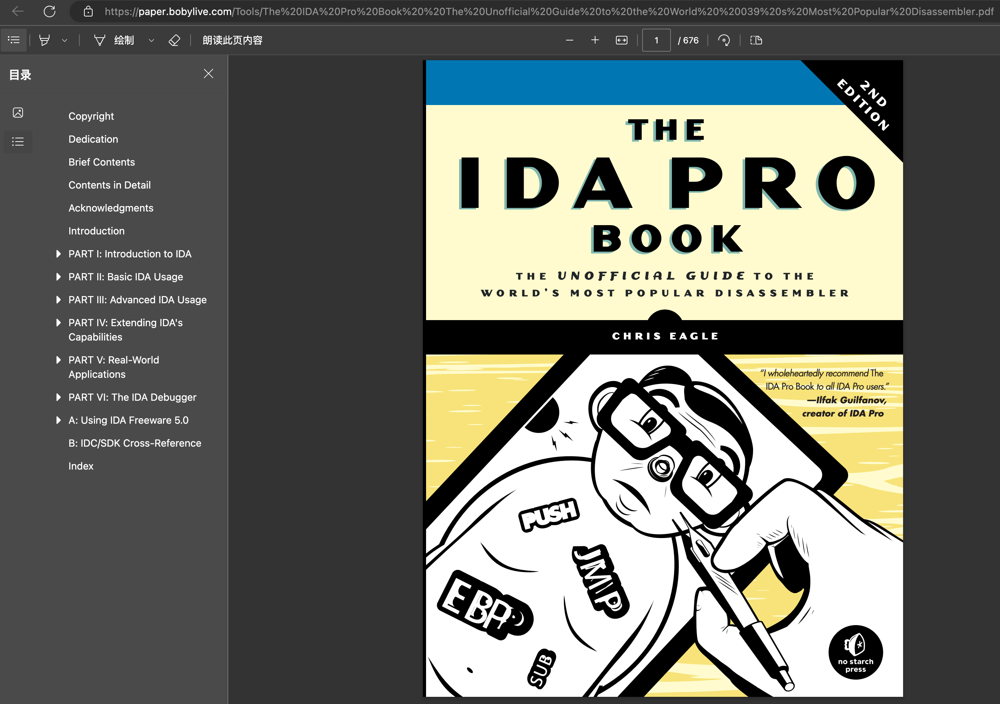

# 文档和资料

此处整理IDA相关的文档、教程、书籍等有价值的参考资料。

## IDA官网

IDA的官网：

https://www.hex-rays.com

本身就有很多不错的教程和资料。

### IDA官网在线文档

* 文档总入口：https://hex-rays.com/documentation/
  * Help总入口：https://hex-rays.com/products/ida/support/idadoc/index.shtml
  * 反编译器：https://hex-rays.com/products/decompiler/manual/index.shtml
    * 其中最常用的一些：
      * 伪代码中右键菜单中的各种功能
        * [Interactive operation](https://hex-rays.com/products/decompiler/manual/interactive.shtml)
      * 常见问题和错误
        * [Failures and troubleshooting](https://hex-rays.com/products/decompiler/manual/failures.shtml)

### IDA的tip of week

[tip of week index (hex-rays.com)](https://hex-rays.com/wp-content/uploads/2021/10/igor-tip-of-the-week-S01.pdf)

有很多有用提示

有空可以看看

### IDA官网的下载中心

IDA官网的下载中心：

[Download center (hex-rays.com)](https://hex-rays.com/download-center/)

有很多相关内容，可供学习和使用：

* SDK and Utilities
  * Some downloads are only available to IDA Pro users and require a password which can be found in the latest download email.
  * IDA SDK 7.7
    * Develop processor modules, loaders and extensions - extended with the source of 30+ modules and 20+ loaders.
    * Please check out the SDK documentation online (or download the zip file for offline use).
  * Flair 7.7
    * Add your own compiler libraries to the FLIRT engine
      * `FLIRT`=`Fast Library Identification and Recognition Technology`
  * IDAClang 7.7
    * A type library generator based on libclang. Use this when parsing complex C++ code that tilib cannot handle.
  * Tilib 7.7
    * Create your own type libraries
  * Loadint 7.7
    * Create your own disassembler comment databases
  * idsutils 7.7
    * Create your own IDS files from DLLs
  * ios_deploy
    * iOS helper utility to manipulate iOS devices
  * PIN tool
    * The source code of our PIN tool. It creates a debugger backend out of Intel's PIN framework
    * See: PIN framework
  * TVision 2015 library
    * For the IDA text interface (source code)
  * Qwingraph v1.10
    * Source code the Wingraph we use and modified (GPL)
* Sample plugins
  * Stealth
    * Stealth against anti-debugging tricks
  * findcrypt
    * Identifies some frequently used block ciphers
  * highlighter
    * Highlights code that has been single stepped through in a debugging session
  * unispector
    * Extracts unicode strings from an IDA database
  * IDA Pro, Python and Qt
  * Migrating PySide code to PyQt5
  * Using custom viewers from IDAPython
  * Augmenting IDA UI with your own actions
  * Plugin contest pages
    * Our plugins contest pages offer many useful plugins!
    * By year: 2009, 2010, 2011, 2012, 2013, 2014, 2015, 2016, 2017, 2018, 2019
* User contributions
  * Plugins
    * COM Interface Plugin
      * By Dieter Spaar
    * Sobek
      * A simple data-flow analysis plugin by JF Michel
    * PDBPlus
      * By Dean Ashton
    * IDB_2_PAT
      * By J.C Roberts
    * strucrec
      * By Halvar Flake
    * Class Informer plugin
      * To reconstruct C++ classes using the RTTI info
      * By Sirmabus
  * IDC scripts
    * Visual Basic Disassembly IDC script
      * To assist in the disassembly of VB5/VB6 hostile code
      * By Reginald Wong
    * IDC Delphi script
      * Delphi constants and class definitions
      * By Dietrich Teickner
    * h2enum
      * converts C/C++ header files to IDA enums - Nice if you have no TIL files
      * By Leonid Lisovsky
    * IDC PDR script
      * Useful in the analysis of PDR files (port drivers)
      * By Huang Yu
    * Loader script
      * For VC++ and Borland C++
      * By Toshiyuki Tega
    * Microchipss 16F84 PIC script
      * Defines SFR and bit names for Microchip's 16F84 PIC processor but can be used as a template for other processors
      * By an anonymous contributor
    * dumpinfo
      * By JC Roberts
    * Pentica-B script
      * Pentica-B import script for the H8-8300
      * By Tom Hayes
    * H8 script
      * Improves the inital H8 autoanalysis
      * By Tom Hayes
  * Processor modules
    * AMD 29K processor module
      * By Arne Wichmann
    * NEC V830 processor module
      * By Ben Byer
    * Samsung SAM8
      * By Andrew de Quincey. Also available is a plugin that generates files compatible with the SAMA assembler.
  * Miscellaneous
    * symload
      * By Dainis Jonitis
    * PE utilities
      * A set of extremely useful PE utilities
      * By Atli Mar Gudmundsson
    * H8 utilities
      * A few utilities that could be useful to H8 developers
      * By Tom Hayes

抽空可以好好找找看看，有哪些值得好好利用的东西。

## 《The IDA Pro Book - The Unofficial Guide to the World's Most Popular Disassembler.pdf》

* [《The IDA Pro Book - The Unofficial Guide to the World's Most Popular Disassembler.pdf》](https://paper.bobylive.com/Tools/The%20IDA%20Pro%20Book%20%20The%20Unofficial%20Guide%20to%20the%20World%20%20039%20s%20Most%20Popular%20Disassembler.pdf)
  * 
  * 评价：
    * 内容详实，值得抽空好好参考和学习
    * 感觉解释的很到位
      * 先介绍背景知识
      * 再介绍反编译
      * 再介绍工具：IDA

-> 已摘录的部分内容：

* 编程语言历史
  * First-generation languages
    * These are the lowest form of language, generally consisting of ones and zeros or some shorthand form such as hexadecimal, and readable only by binary ninjas. Things are confusing at this level because it is often difficult to distinguish data from instructions since everything looks pretty much the same. First-generation languages may also be referred to as machine languages, and in some cases byte code, while machine language programs are often referred to as binaries.
  * Second-generation languages
    * Also called assembly languages, second-generation languages are a mere table lookup away from machine language and generally map specific bit patterns, or operation codes (opcodes), to short but memorable character sequences called mnemonics. Occasionally these mnemonics actually help programmers remember the instructions with which they are associated.
    * An assembler is a tool used by programmers to translate their assembly language programs into machine language suitable for execution.
  * Third-generation languages
    * These languages take another step toward the expressive capability of natural languages by introducing keywords and constructs that programmers use as the building blocks for their programs. Third-generation languages are generally platform independent, though programs written using them may be platform dependent as a result of using features unique to a specific operating system. Often-cited examples include FORTRAN, COBOL, C, and Java. Programmers generally use compilers to translate their programs into assembly language or all the way to machine language (or some rough equivalent such as byte code).
  * Fourth-generation languages
    * These exist but aren’t relevant to this book and will not be discussed
* 反汇编器、反编译器 的由来
  * In a traditional software development model, compilers, assemblers, and linkers are used by themselves or in combination to create executable programs. In order to work our way backwards (or reverse engineer programs), we use tools to undo the assembly and compilation processes. Not surprisingly, such tools are called disassemblers and decompilers, and they do pretty much what their names imply. A disassembler undoes the assembly process, so we should expect assembly language as the output (and therefore machine language as input). Decompilers aim to produce output in a high-level language when given assembly or even machine language as input.
* 为何恢复源代码source code recovery 不太容易？
  * The compilation process is lossy.
    * At the machine language level there are no variable or function names, and variable type information can be determined only by how the data is used rather than explicit type declarations. When you observe 32 bits of data being transferred, you’ll need to do some investigative work to determine whether those 32 bits represent an integer, a 32-bit floating point value, or a 32-bit pointer.
  * Compilation is a many-to-many operation.
    * This means that a source program can be translated to assembly language in many different ways, and machine language can be translated back to source in many different ways. As a result, it is quite common that compiling a file and immediately decompiling it may yield a vastly different source file from the one that was input.
  * Decompilers are very language and library dependent.
    * Processing a binary produced by a Delphi compiler with a decompiler designed to generate C code can yield very strange results. Similarly, feeding a compiled Windows binary through a decompiler that has no knowledge of the Windows programming API may not yield anything useful.
  * A nearly perfect disassembly capability is needed in order to accurately decompile a binary.
    * Any errors or omissions in the disassembly phase will almost certainly propagate through to the decompiled code.
* 反汇编的典型用途
  * The purpose of disassembly tools is often to facilitate understanding of programs when source code is unavailable. Common situations in which disassembly is used include these:
    * Analysis of malware
    * Analysis of closed-source software for vulnerabilities
    * Analysis of closed-source software for interoperability
    * Analysis of compiler-generated code to validate compiler performance/correctness
    * Display of program instructions while debugging

## BH_Eagle_ida_pro.pdf

无意间看到的别人整理的IDA的内容：

[BH_Eagle_ida_pro.pdf](https://www-verimag.imag.fr/~mounier/Enseignement/Software_Security/BH_Eagle_ida_pro.pdf)

下载到此处 [BH_Eagle_ida_pro.pdf](assets/../../assets/files/BH_Eagle_ida_pro.pdf) 供下载和学习。

## 其他待学习和待研究的资料

* [IDA software reverse engineering - Code World (codetd.com)](https://www.codetd.com/en/article/12818634)
  * IDA的用法，内容很多，值得看看。
* [IDA Pro Tips to Add to Your Bag of Tricks – PT SWARM (ptsecurity.com)](https://swarm.ptsecurity.com/ida-pro-tips/)
  * 这里有很多感觉有用的，值得参考的内容，抽空去研究学习
* 