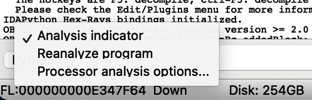
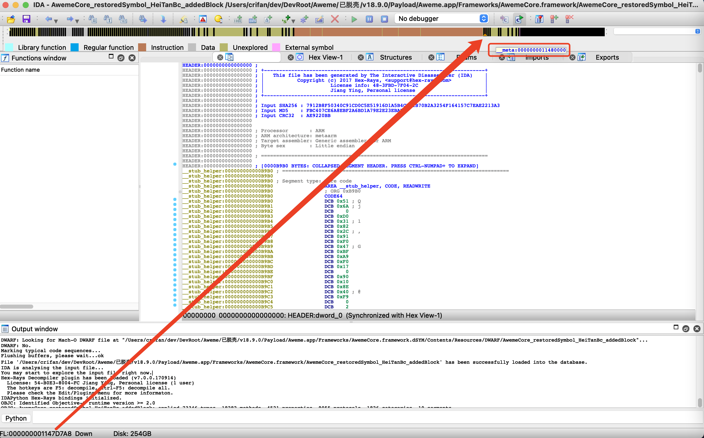
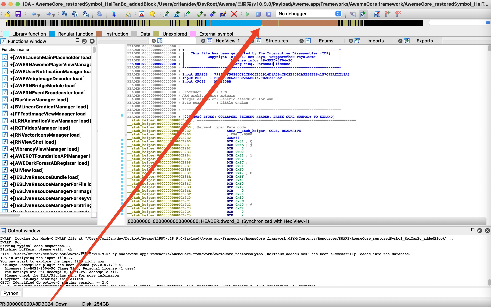
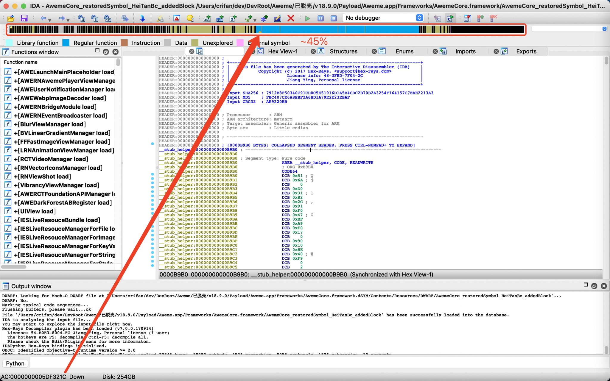
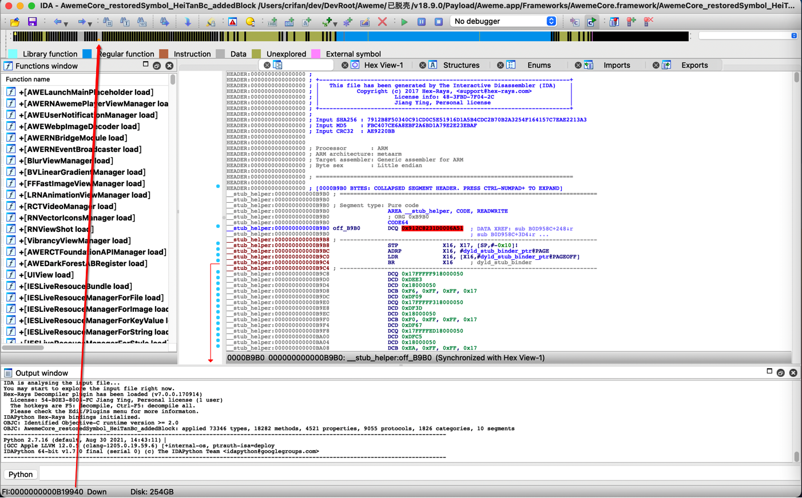
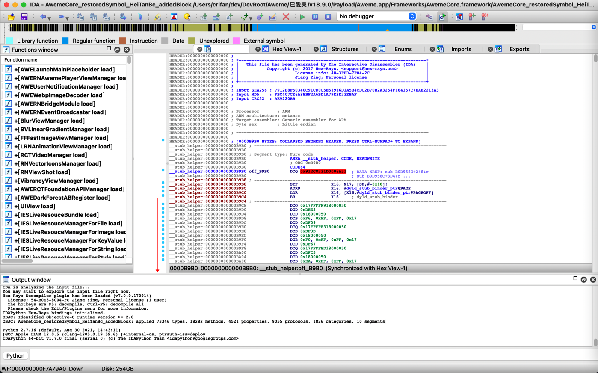
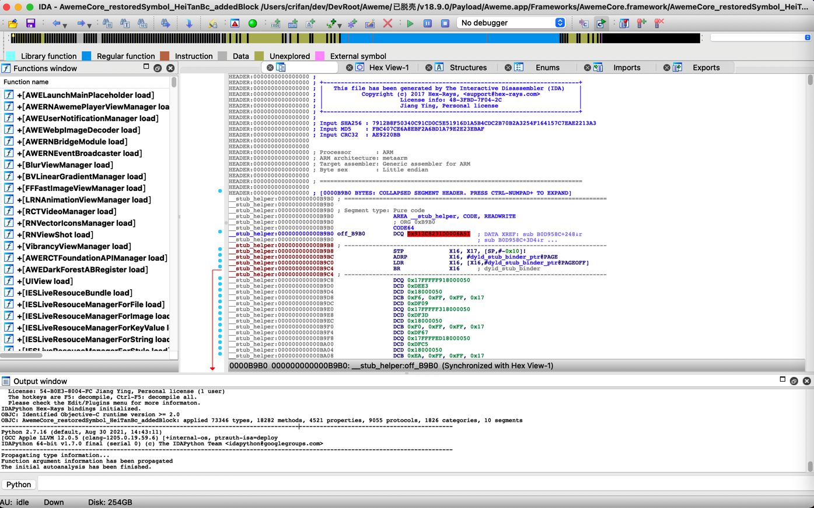

# 自动分析

典型过程：把二进制文件拖动到IDA后，就开始自动分析`了。

IDA中默认已开启左下角的：

* `Analysis indicator`=`自动分析指示器`
  * 图
    * 
  * 作用：可以显示当前自动分析的进度

## 为何要（自动）分析？

我们用IDA去分析二进制中代码的逻辑。

而二进制本身其实只有`0`和`1`二进制数据而已。

而想要分析代码，即查看对应二进制对应的`汇编代码`（以及后续的`伪代码`），所包含的函数，所包含的字符串等等信息，则就需要：

对二进制进行充分的分析，最后才能显示出我们要的上述的各种信息。

而对于二进制加载后的分析过程，IDA叫做：

* `自动分析`=`auto analysis`

## 自动分析的过程和阶段

自动分析会先后有多个阶段，其中阶段的名称是2个字母的缩写，可以在左下角看到

具体阶段和含义是：

* `FL:<address>` execution **FL**ow is being traced
* `PR:<address>` a function (=**PR**ocedure?) is being created
* `TL:<address>` a function **T**ai**L** is being created
* `SP:<address>` the **S**tack **P**ointer is being traced
* `AC:<address>` the **A**ddress is being analyzed
* `LL:<number> ` a signature file is being loaded
* `L1:<address>` the first pass (**L**evel **1**) of FLIRT
* `L2:<address>` the second pass (**L**evel **2**) of FLIRT
* `L3:<address>` the third pass (**L**evel **3**) of FLIRT
* `TP:<address>` **TP**pe information is being applied
* `FI:<address>` the **FI**nal pass of autoanalysis
* `WF:<address>` **W**eak execution **F**low is being traced
* `AU:  idle`    **A**utoanalysis is finished

### 不同阶段举例

* FL=Flow
  * 
* PR=PRocedure
  * 
* AC = Address
  * 
* FI=Final
  * 
* WF=Weak
  * 
* WU: idle
  * 

## 自动分析要多长时间

自动分析完毕所需时间，取决于，二进制文件大小，以及其内部逻辑复杂程度

一般来说：

* 很小的二进制文件：耗时很短，马上就结束了
  * 举例
    * 几十KB的抖音Aweme，耗时很短，没几分钟就结束了
* 很大的二进制文件：耗时很久，有的长达数个小时
  * 举例
    * 200多MB的抖音AwemeCore，IDA自动解析最终耗时，大约12个小时
