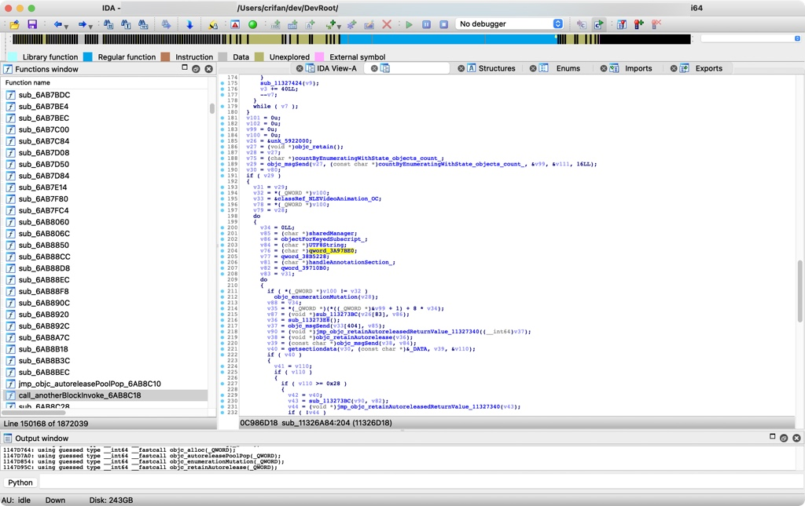
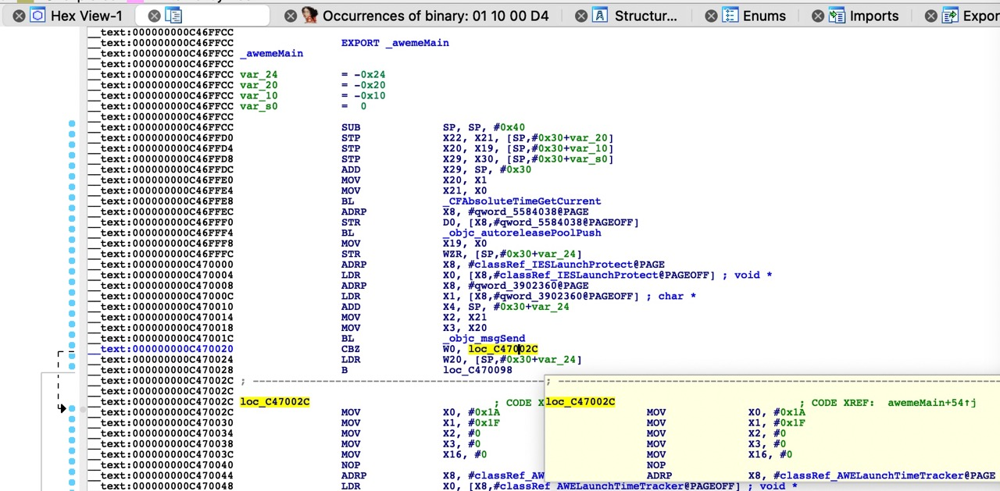
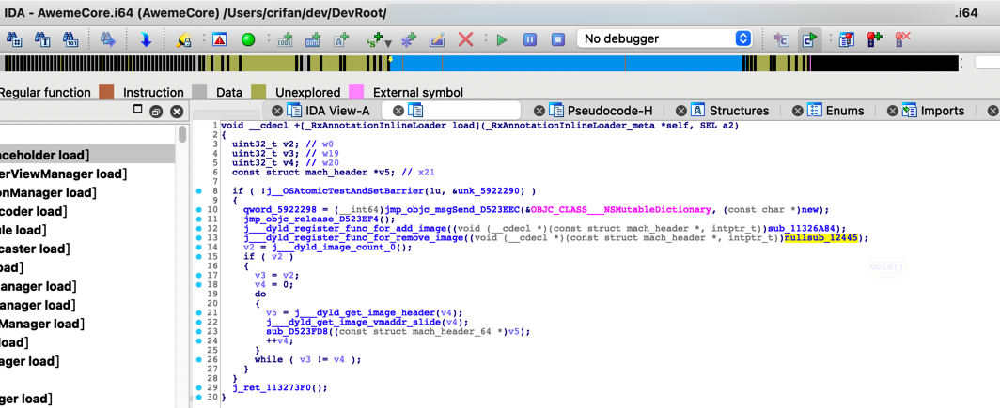
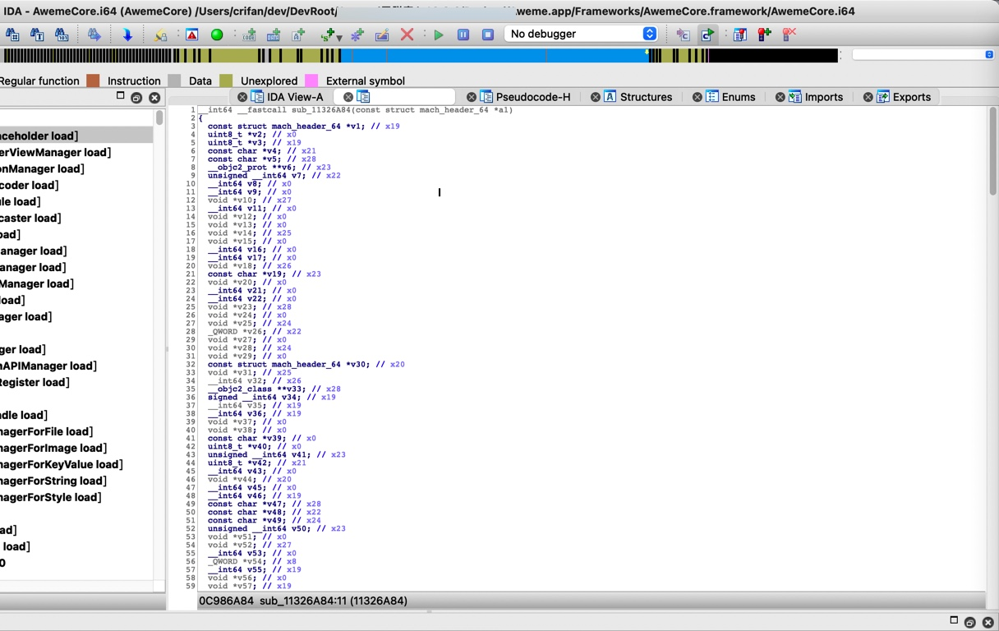
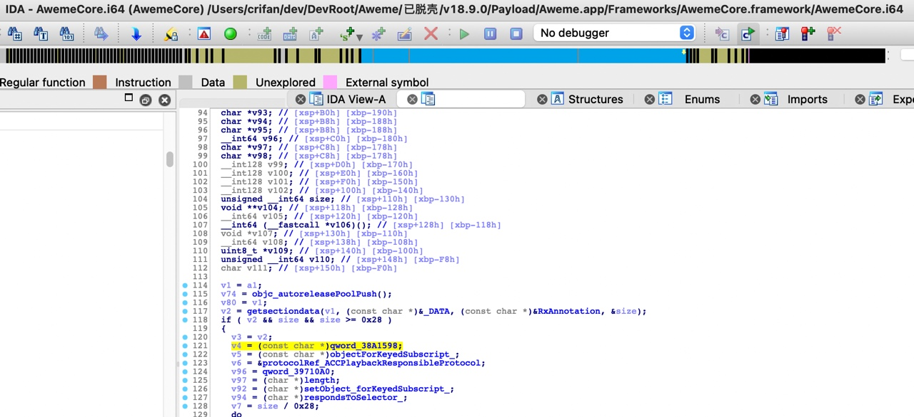
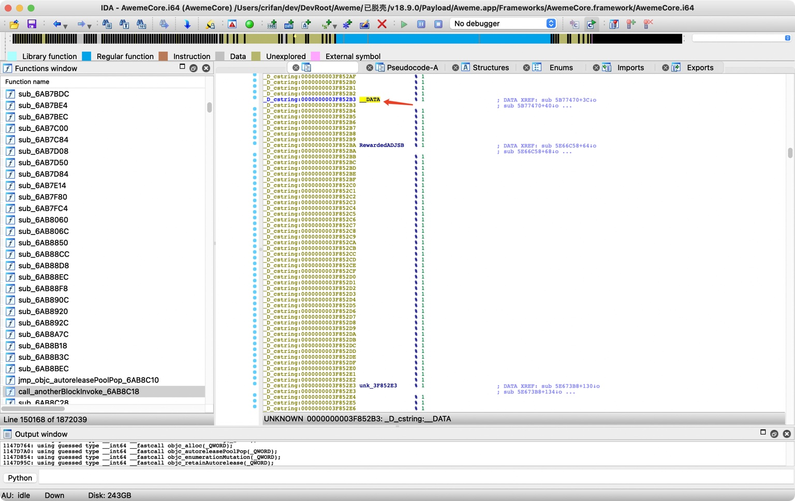

# 举例

* 概述
  * 各种
    * 
      * `sub_B7CBB90`
      * `loc_B7CBBC4`
      * `locret_B7CBC00`
  * `sub`
    * `sub_11326A84`
      * 
  * `unk`
    * `unk_5922000`
      * 
    * `unk_196E8C0`
      * 
  * `qword`
    * `qword_3A97BE0`
      * 
  * `loc`
    * `loc_C47002C`
      * 

详解：

## sub函数

关于sub函数的一些细节说明：

* `sub_xxx`：普通的函数（有代码处理逻辑的）
  * 比如去改名的话，可以改名叫做：
    * sub_BinaryOffset
    * sub_AddressInsideBinary
* `nullsub_xxx`：`空函数`（没有任何代码逻辑的）
  * IDA中关于`空函数`的介绍
    ```bash
    Rename empty functions as nullsub_...
      This option allows IDA to rename empty functions containing only a "return" instruction as "nullsub_..."
      (... is replaced by a serial number: 0,1,2,3...)
    ```

此处给出实例：

举例：

【未解决】研究抖音越狱检测逻辑：_RxAnnotationInlineLoader的load

中的：

```c
void __cdecl +[_RxAnnotationInlineLoader load](_RxAnnotationInlineLoader_meta *self, SEL a2)
{
。。。
    j___dyld_register_func_for_add_image((void (__cdecl *)(const struct mach_header *, intptr_t))sub_11326A84);
    j___dyld_register_func_for_remove_image((void (__cdecl *)(const struct mach_header *, intptr_t))nullsub_12445);
```



* _dyld_register_func_for_add_image传入的函数：sub_11326A84
  * 就是个普通的，内部有代码逻辑的函数：
    * 
* _dyld_register_func_for_remove_image传入的函数：nullsub_12445
  * 从名字看，就知道：是个null的 空的 函数
  * 进入看，果然是空的，啥也没有
    * 

## qword

对于qword：

* 常常是：常量字符串
* 偶尔是：其他类型
  * 比如字典的指针等等

* 核心逻辑是：
  * qword_xxx的xxx是二进制内偏移量 + 二进制的ALSR = 实际（字符串的）地址
  * 去查看： 实际（字符串的）地址 = （即可查看到）保存了对应的字符串

此处举例说明：

IDA伪代码：



```c
    v4 = (const char *)qword_38A1598;
```

计算`qword_38A1598`的实际的值是什么

而通过此处的类型强制转换`(const char *)`可以看出是个字符串，所以此处就是去看看：到底字符串的值是什么

先查看当前二进制的ALSR基地址：

```c
(lldb) image list -o -f | grep AwemeCore
[  0] 0x0000000100a98000 /Users/crifan/Library/Developer/Xcode/DerivedData/Aweme-fswcidjoxbkibsdwekuzlsfcdqls/Build/Products/Debug-iphoneos/Aweme.app/Frameworks/AwemeCore.framework/AwemeCore
```

再继续计算此处的字符串的值：

```c
(lldb) p/x 0x0000000100a98000 + 0x38A1598
(long) $7 = 0x0000000104339598
(lldb) x/1gx 0x0000000104339598
0x104339598: 0x000000010185c42e
(lldb) po (char*)0x000000010185c42e
"dynamicCast:"
```
## unk

`unk`本身是IDA伪代码解析后，不知道变量具体的值什么类型，所以无法给出更加精准的变量命令。

此处，通过具体例子来介绍，如何调试和计算真实的值

### unk_3F852B3是字符串

比如：

```c
__int64 __fastcall sub_11326A84(const struct mach_header_64 *a1)
{
。。。
  v2 = getsectiondata(v1, (const char *)&unk_3F852B3, (const char *)&unk_47DC9B8, &size);
  if ( v2 && size && size >= 0x28 )
  {
。。。
    v4 = (const char *)qword_38A1598;
```

其中的：`unk_3F852B3`

由名字可知，该变量的地址是：`3F852B3`

IDA中通过地址可以查看到内容=定义是：

```c
_D_cstring:0000000003F852B3 unk_3F852B3     % 1                     ; DATA XREF: sub_5B77470+3C↓o
```

是看不出具体类型和具体的值的。

不过，此处动态调试期间，可以根据地址算出来：

`unk_RelativeAddress` -> `ALSR`基地址 + `RelativeAddress` = 当前内存地址

先去看：ALSR基地址 = 二进制加载的首地址 = 此处是抖音的`AwemeCore`加载的首地址 = 如前面已计算出是`0x0000000100a98000`

计算过程：

```bash
(lldb) p/x 0x0000000100a98000 + 0x3F852B3
(long) $0 = 0x0000000104a1d2b3
(lldb) po (char*)0x0000000104a1d2b3
"__DATA"

(lldb) x/1gx 0x0000000104a1d2b3
0x104a1d2b3: 0x5200415441445f5f
(lldb) po (char*)0x5200415441445f5f
""
```

所以才看出此时：

`unk_3F852B3` == "__DATA"

所以再去优化IDA中的代码：把`unk_3F852B3`改名为`__DATA`



以及，IDA伪代码中，也去刷新即可看到新的变量名：

```c
  v2 = getsectiondata(v1, (const char *)&_DATA, (const char *)&RxAnnotation, &size);
  if ( v2 && size && size >= 0x28 )
```

-> 从而使得代码逻辑稍微更加清晰了一点。

-> 类似的，别的`unk`的地址，也可以计算出调试时的内存地址，从而查看到是什么值

* `unk_3F852BA`
  ```c
  (lldb) p/x 0x0000000100a98000 + 0x3F852BA
  (long) $3 = 0x0000000104a1d2ba
  (lldb) po (char*)0x0000000104a1d2ba
  "RewardedADJSB"
  ```
* `unk_47DC9B8`
  ```c
  (lldb) p/x 0x0000000100a98000 + 0x47DC9B8
  (long) $5 = 0x00000001052749b8
  (lldb) po (char*)0x00000001052749b8
  "RxAnnotation"
  ```

### unk_1B52440是字符串

再给出一个例子，介绍如何计算unk的值：

IDA伪代码：


```c
  v60 = objc_msgSend(
          &OBJC_CLASS___NSString,
          stringWithFormat,
          &unk_1B52440,
          **(_QWORD **)v42,
          **((_QWORD **)v42 + 1),
          **((_QWORD **)v42 + 2),
          v72);
```

IDA中定义是：

```c
_D_cfstring:0000000001B52440 unk_1B52440     % 1                     ; DATA XREF: sub_11326A84+4B0↓o
```


注意到其中的`_D_cfstring` =`constant string` ?

去计算值：

```c
(lldb) p/x 0x0000000103008000 + 0x1B52440
(long) $16 = 0x0000000104b5a440

(lldb) po (char*)0x0000000104b5a440
RxAnnotation:%@-%@-%@
```


即：

`unk_1B52440` = `constant string`常量字符串：`RxAnnotation:%@-%@-%@`

然后去优化IDA伪代码，把`unk_1B52440`改为更容易读懂的名字，比如`RxAnnotation_percentAt_percentAt_percentAt`。

另外类似的例子：

* `unk_1942B60`

IDA伪代码：

```c
        jmp_objc_msgSend_D523EEC(HMDNetworkReqModelObj, (const char *)setMethod_, &unk_1942B60);
```

IDA中定义：

```c
_D_cfstring:0000000001942B60 unk_1942B60     % 1                     ; DATA XREF: sub_59FA0FC+14↓o
_D_cfstring:0000000001942B60                                         ; sub_59FA0FC+18↓o ...
```

计算逻辑：

```c
(lldb) p/x 0x0000000105140000 + 0x1942B60
(long) $22 = 0x0000000106a82b60
(lldb) po (char*)0x0000000106a82b60
POST

(lldb) po [0x0000000106a82b60 class]
__NSCFConstantString
```

-> `unk_1942B60`是`__NSCFConstantString`字符串常量：`"POST"`
