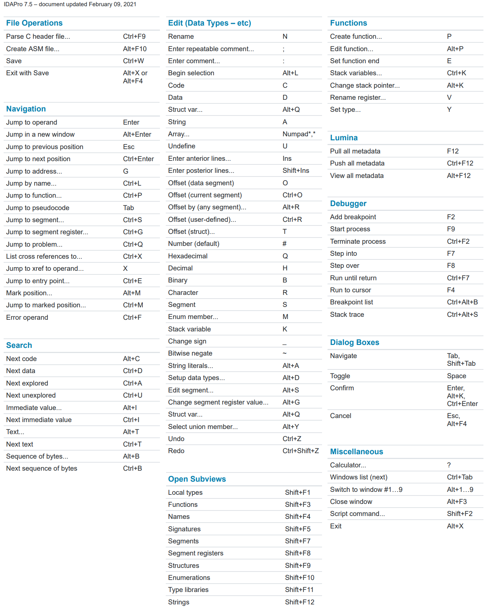

# 快捷键

此处整理IDA的快捷键：

[IDA_Pro_Shortcuts.pdf (hex-rays.com)](https://www.hex-rays.com/products/ida/support/freefiles/IDA_Pro_Shortcuts.pdf)

由于：`快捷键`=`Shortcut`=`cheatsheet`

所以此处是：`IDA Pro Cheatsheet`

