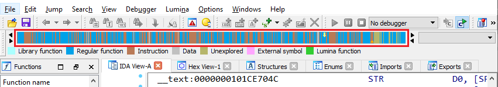

# 界面布局

TODO：

* 【整理】IDA使用心得：多种显示模式
* 【已解决】IDA中浮动窗口Output Window如何固定到底部

---

此处整理，IDA中关于界面显示和布局方面的内容。

## 导航条=navigator

关于这个：

`Navigation band`=`navigator`=`navbar`=`导航栏`=`导航条`

有专门的介绍

[Igor’s tip of the week #49: Navigation band – Hex Rays (hex-rays.com)](https://hex-rays.com/blog/igors-tip-of-the-week-49-navigation-band/)

有空可以好好学习看看
