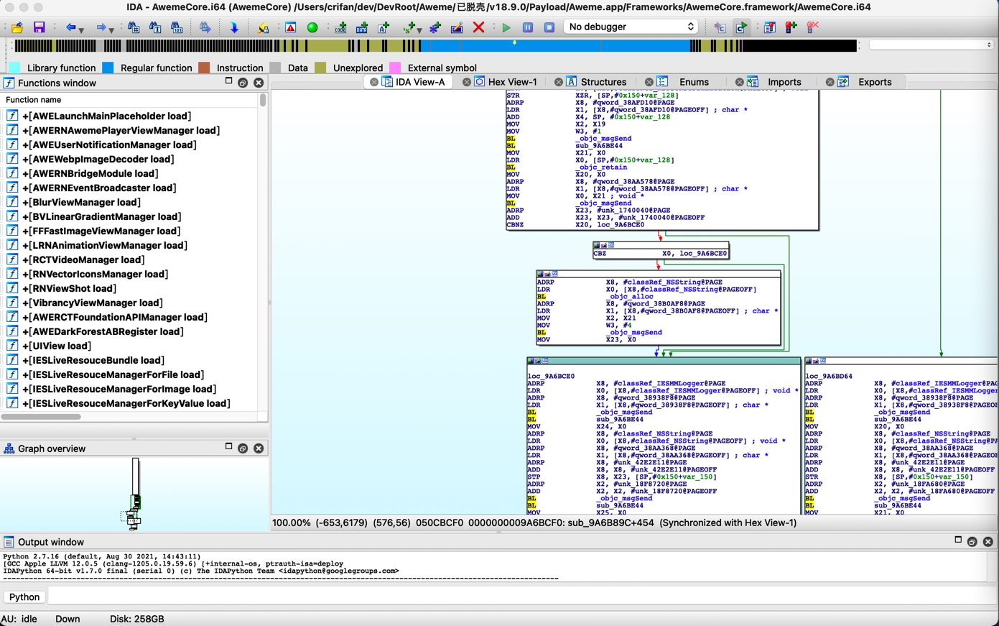
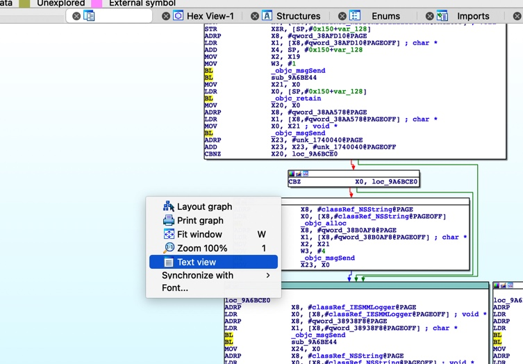
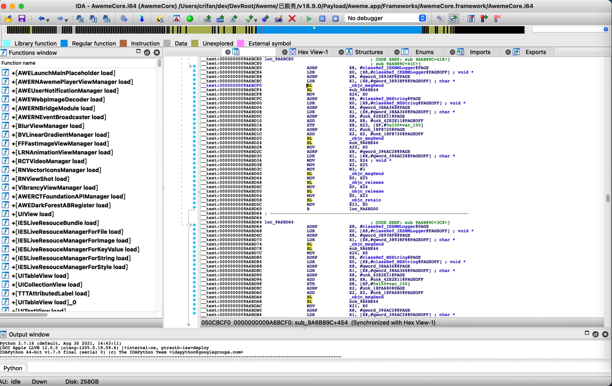
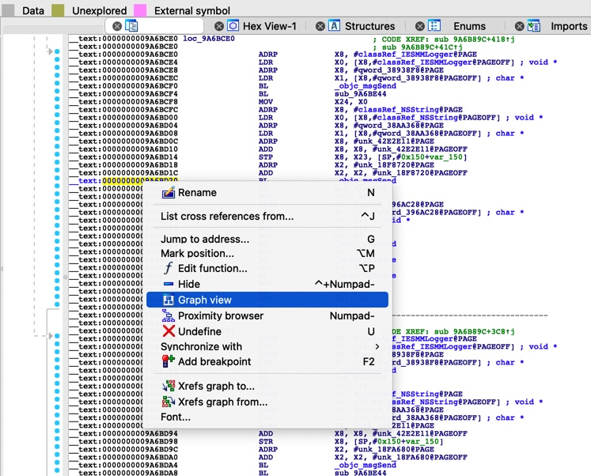
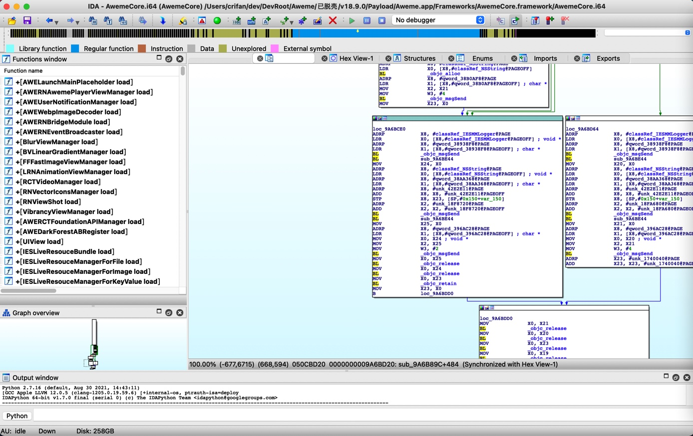
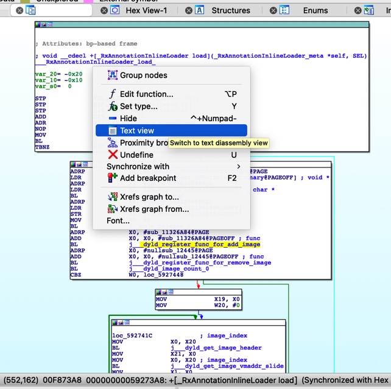
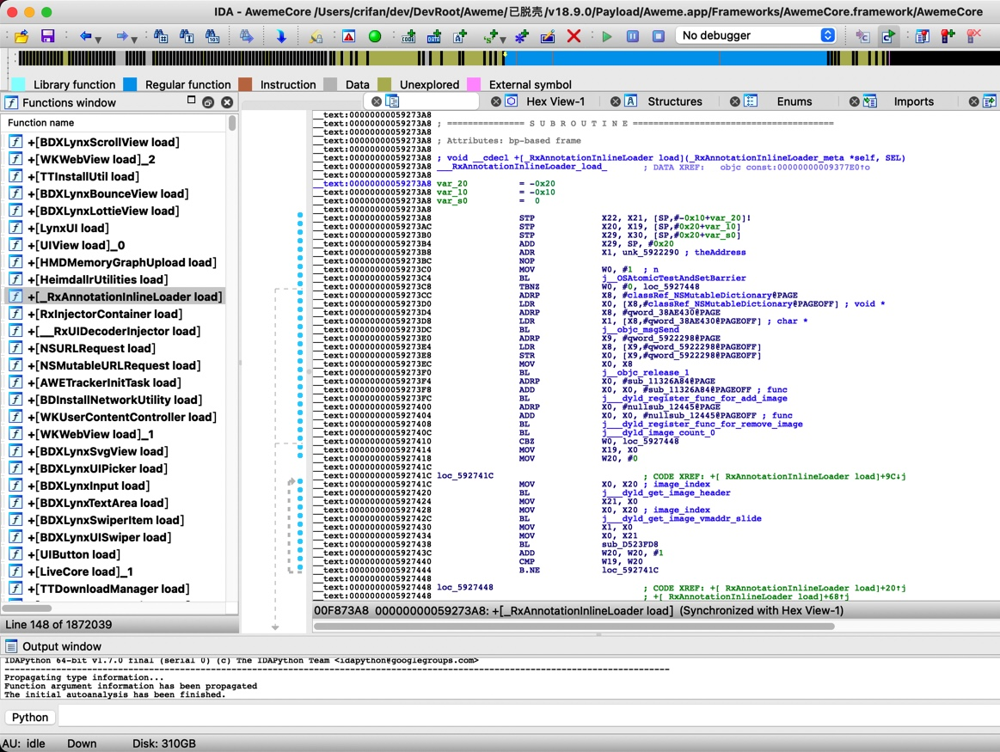
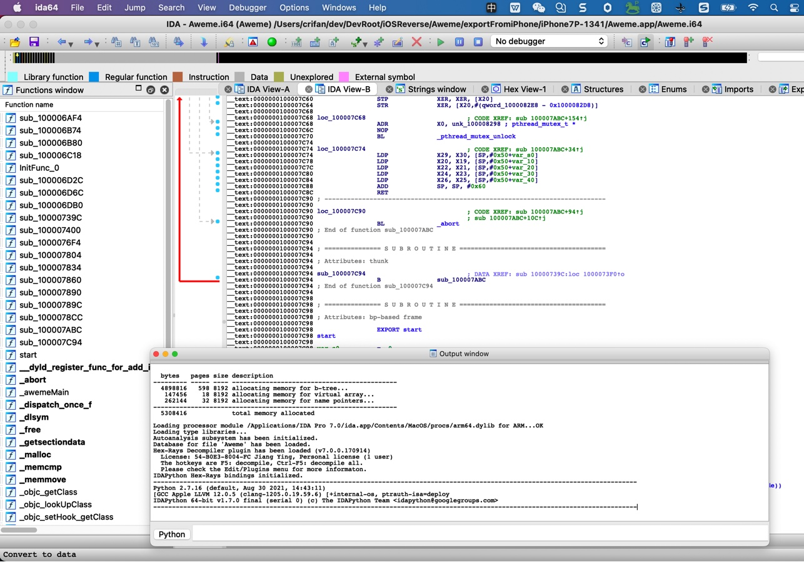
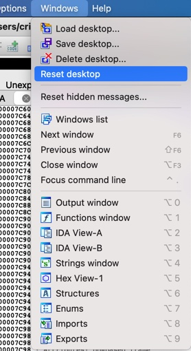
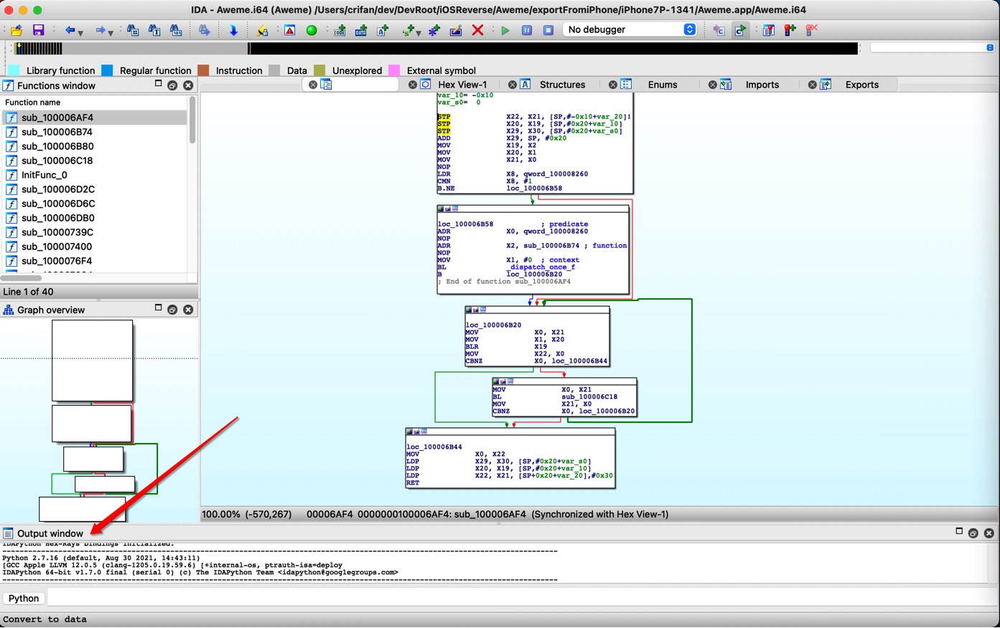

# 界面布局

此处整理，IDA中关于界面显示和布局方面的内容。

## 导航条=navigator

关于这个：

`Navigation band`=`navigator`=`navbar`=`导航栏`=`导航条`

有专门的介绍

[Igor’s tip of the week #49: Navigation band – Hex Rays (hex-rays.com)](https://hex-rays.com/blog/igors-tip-of-the-week-49-navigation-band/)

有空可以好好学习看看

## 切换显示模式

### `Text View`和`Graph View`

`IDA View-A`：在`Text View`和`Graph View`模式之间切换

这个叫做：`Graph View`=图形视图

好处：方便看函数调用的逻辑关系

如果想要切换到：`文本模式`，`汇编模式`

则可以：`右键`-》`Text View`

同理，从Text View想要切换到Graph View，也可以：

`右键`-》`Graph View`

回到了：graph视图

### 函数调用图 和 `Text View`

从函数调用图 切换到原先汇编指令形式：

切换到：`IDA View`

## 如何把浮动窗口`Output Window`固定到底部

问题：IDA中的`Output Window`，不知何故，悬浮在主体窗口上面了：

希望是：能固定到底部或左下角等位置

解决办法：

`IDA`->`Window`->`Reset desktop`

可以恢复IDA桌面原始布局

-》从而使得此处的`Output Window`，恢复最初的位置=固定在最底部的位置

