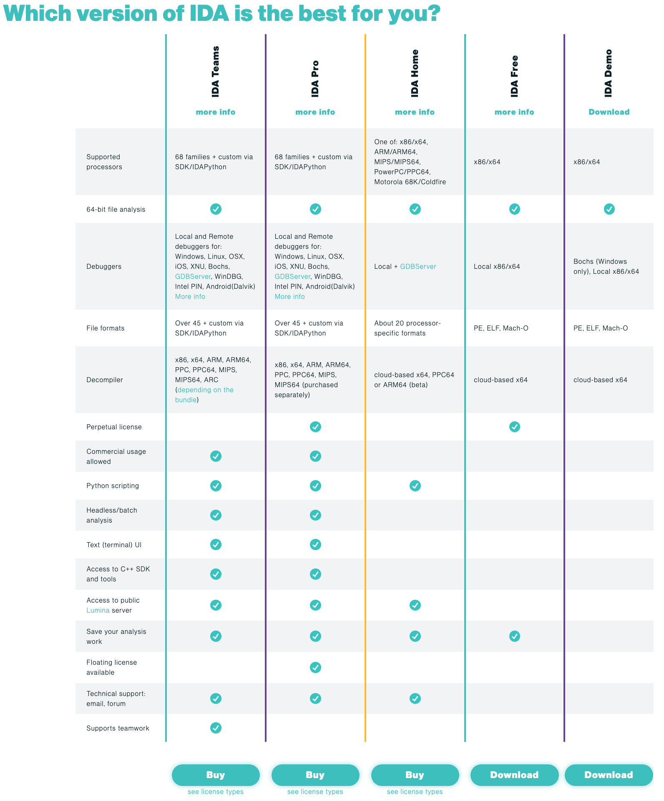

# 版本

## IDA软件的不同版本

* 常用结论
  * 此处iOS逆向的话，常用的是`v7.0`的`IDA Pro`（中64位的`id64`）
* 概述
  * `IDA Teams`：Collaborative reverse-engineering work
    * 团队合作时才需要
  * `IDA Pro`：The state-of-the-art binary code analysis tool
    * 常简称为`IDA` -> 大家常说的**IDA**，指的是**IDA Pro**
    * 功能最全，最强大，但**价格也最贵**
  * `IDA Home`：Affordable tool for reverse engineering hobbyists
    * 功能相对没`IDA Pro`全，但对于个人（应该）基本够用，价格相对也便宜点（所以宣传是Affordable）
  * `IDA Free`：Free binary code analysis tool to evaluate IDA's basic functionalities
    * 免费，但功能有限
  * `IDA Demo`：仅仅作演示用，了解功能而已
* 详解
  * 

## IDA的历史版本号

* 心得
  * 刚发现，IDA的版本号，是`Major.Minor.ReleaseDate`的模式
    * 举例
      * IDA 8.1.221006 October 6, 2022
        * `8.1.221006`
          * `8.1`：主次版本号
          * `221006`：发布日期=October 6, 2022

历史发布的所有版本：

[IDA updates and releases](https://hex-rays.com/products/ida/news/)

* IDA 8.x
  * IDA 8.1.221006 October 6, 2022
  * IDA 8.0.220829 (SP1) August 29, 2022
  * IDA 8.0.220729 July 29, 2022
* IDA 7.x
  * IDA 7.7.220118 (SP1) January 18, 2022
  * IDA 7.7.211224 December 24, 2021
  * IDA 7.6.210427 (SP1) April 28, 2021
  * IDA 7.6.210322 March 22, 2021
  * IDA 7.5.201028 (SP3) October 28, 2020
  * IDA 7.5.200728 (SP2) July 28, 2020
  * IDA 7.5.200619 (SP1) June 19, 2020
  * IDA 7.5.200519 May 19, 2020
  * IDA 7.4.191112 (SP1) November 12, 2019
  * IDA 7.4.191011 October 11, 2019
  * IDA 7.3.190614 June 14, 2019
  * IDA 7.2.181105 November 5, 2018
  * IDA 7.1.180227 February 27, 2018
  * IDA 7.0.171130 (SP1) November 30, 2017
  * IDA 7.0.190914 September 14, 2017
* IDA 6.x
  * IDA 6.95.160808 August 08, 2016
  * IDA 6.9.151221 December 21, 2015
  * IDA 6.8.150413 April 13, 2015
  * IDA 6.7.141229 December 29, 2014
  * IDA 6.6.140604 June 04, 2014
  * IDA 6.5.131217 December 17, 2013
  * IDA 6.4.130306 March 6, 2013
  * IDA 6.4 January 10, 2013
  * IDA 6.3 May 31, 2012
  * IDA 6.2 October 05, 2011
  * IDA 6.1 April 08, 2011
  * IDA 6.0 October 01, 2010
* IDA 5.x
  * IDA 5.7 June 25, 2010
  * IDA 5.6 December 30, 2009
  * IDA 5.5 June 12, 2009
  * IDA 5.4 January 29, 2009
  * IDA 5.3 July 14, 2008
  * IDA 5.2 November 20, 2007
  * IDA 5.1 February 21, 2007
  * IDA 5.0 March 23, 2006
* IDA 4.x
  * IDA 4.9(SP) January 27, 2006
  * IDA 4.9 September 25, 2005
  * IDA 4.8 March 15, 2005
  * IDA 4.7 August 2004
  * IDA 4.6 October 27, 2003
  * IDA 4.x August 29, 2022
* IDA 3.x
  * IDA 3.x
