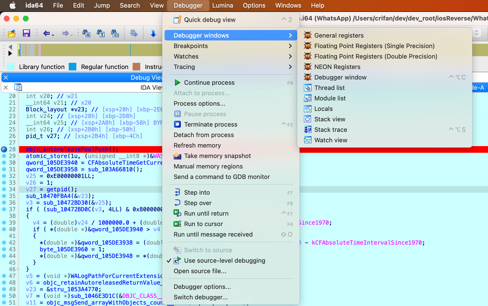
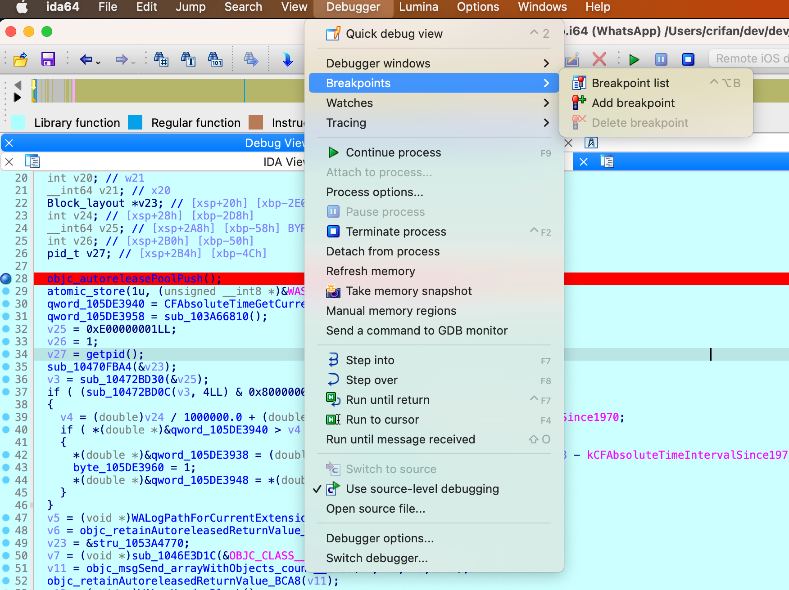
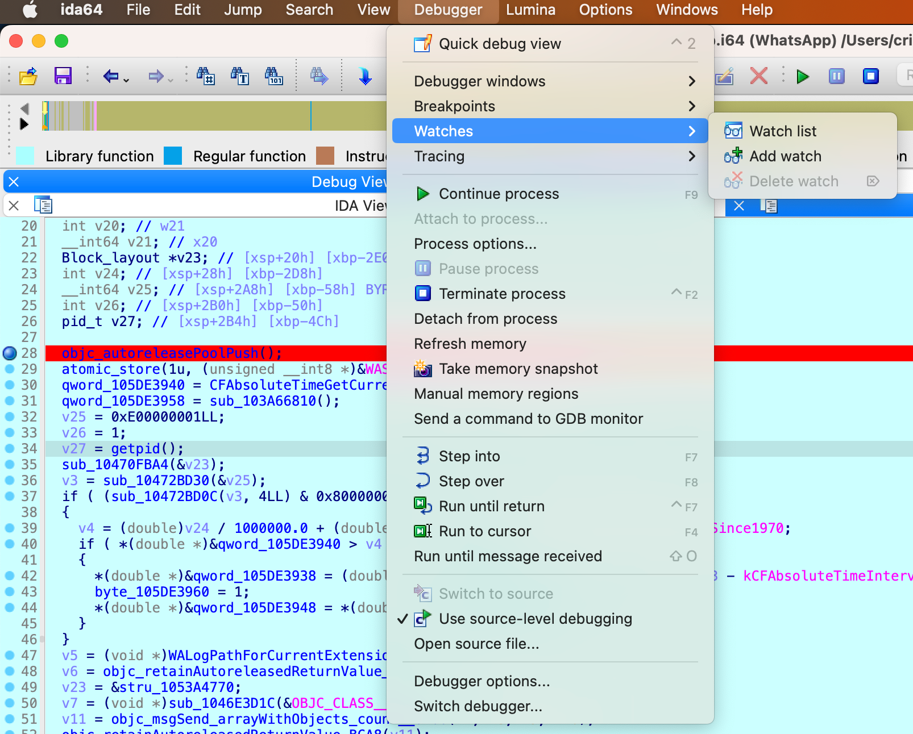
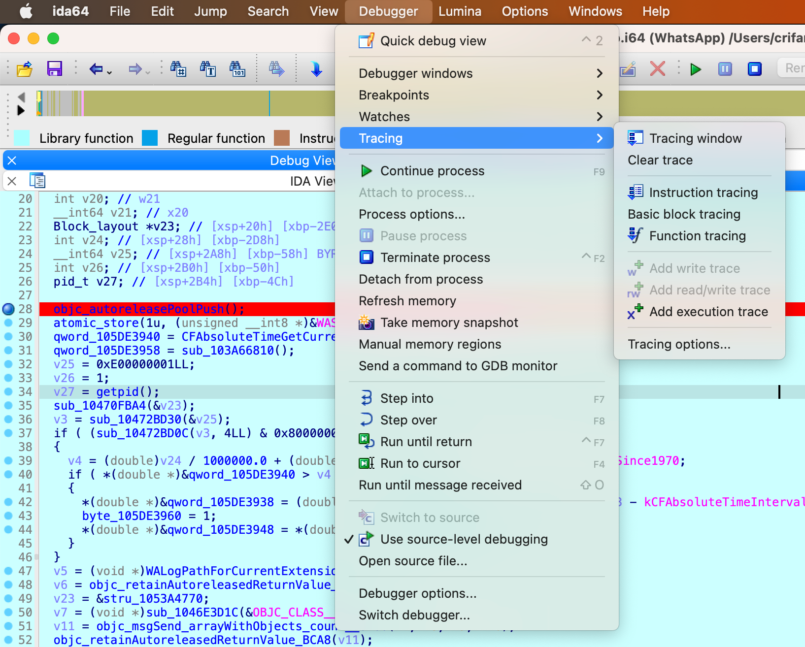
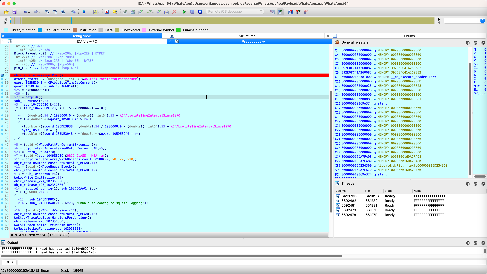
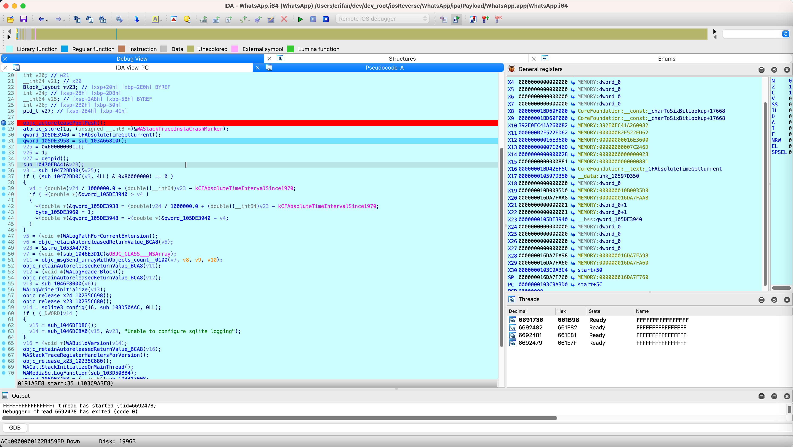
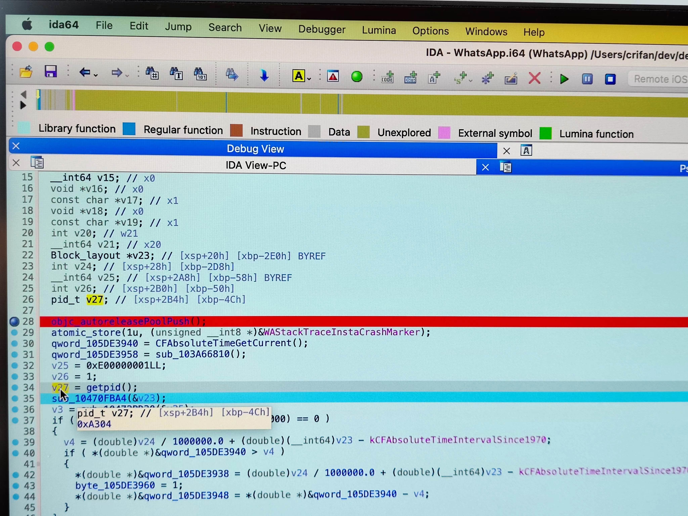

# 开始调试

## 调试命令

* IDA基本调试命令
  * `Step Into` = `F7` = `单步进入` = `单步步入`
  * `Step Over` = `F8` = `单步执行` = `单步步过`
  * `Run until return` = `Ctrl+F7` = `运行直到返回`
  * `Run to cursor` = `F4` = `运行到鼠标处`
  * `Run until message received` = `Alt+O`

## 调试菜单

顺带看看相关菜单：

* `IDA`->`Debugger`
  * `Debugger window`
    * 
  * `Breakpoints`
    * 
  * `Watches`
    * 
  * `Tracing`
    * 

## 调试过程

之前已进入调试界面：



按了几次F8后，可以看到相关界面数据有变化：



几次单步后，了解了点逻辑：

鼠标移动到变量上，可以查看到实时的值：



此处`v27`类型是`pid_t`，值是`0xA304`

其中

```bash
iPhone7-1331:~ root# ps -A | grep WhatsApp
41732 ??         0:00.69 /var/containers/Bundle/Application/2BE964D4-8DF0-4858-A06D-66CA8741ACDC/WhatsApp.app/WhatsApp
57080 ttys000    0:00.01 grep WhatsApp
```

->

* `41732` = `0xA304`

是对得上的。

不过没有能查看到 局部变量的窗口

感觉只能是：鼠标移动到某个变量，查看单个变量的实时的值。且只能看到：16进制=二进制的值

目前就这样。