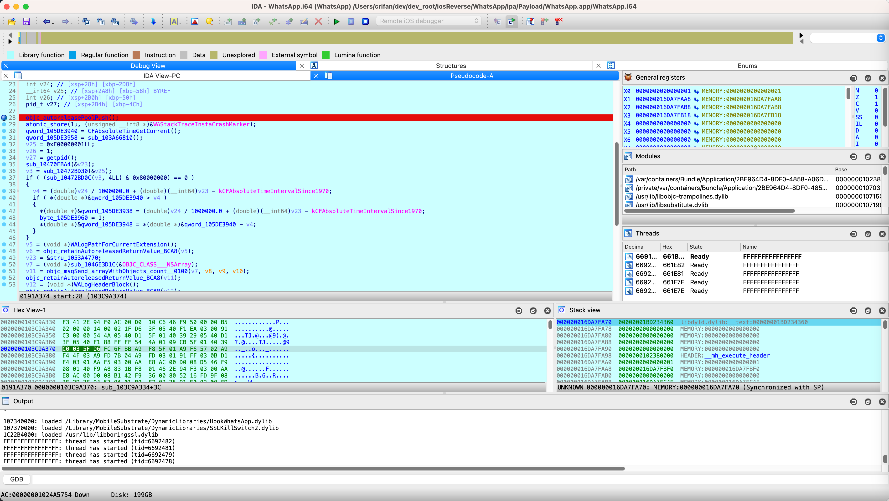
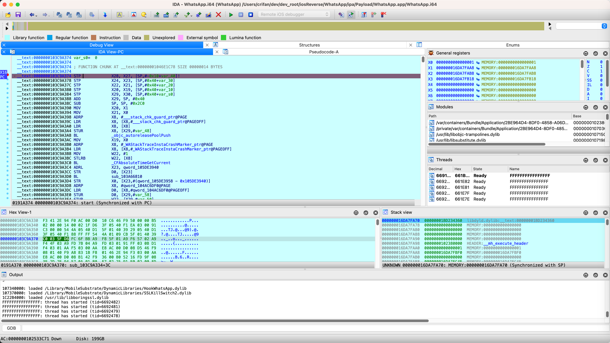
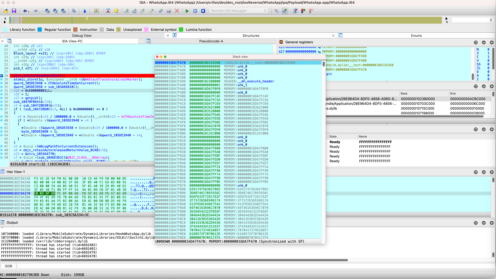
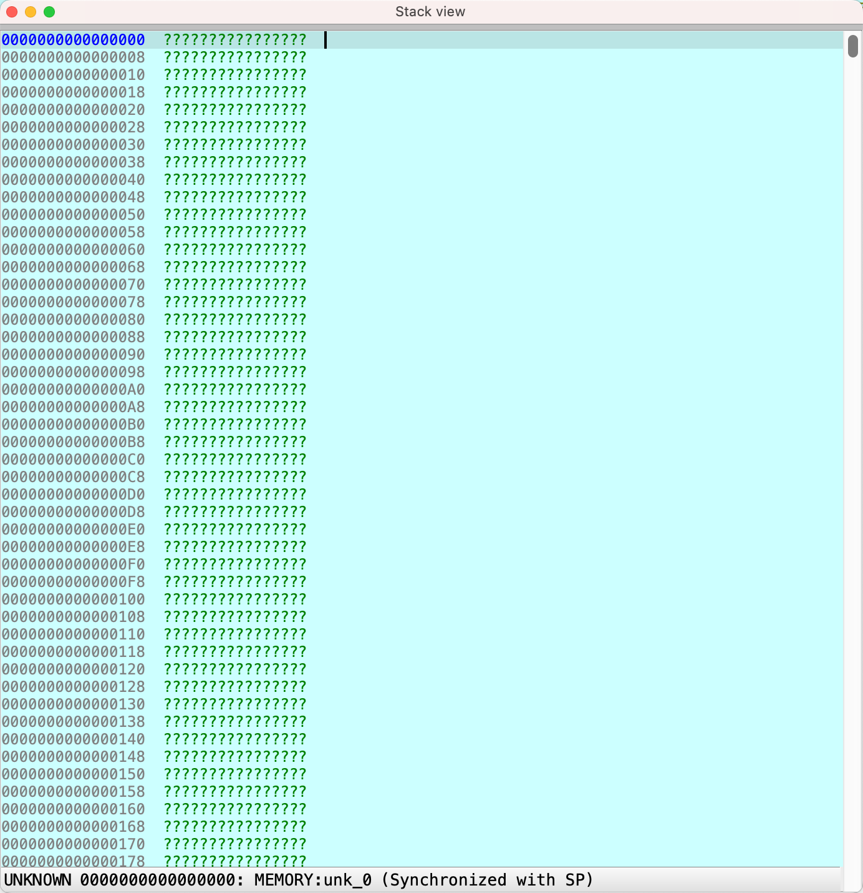
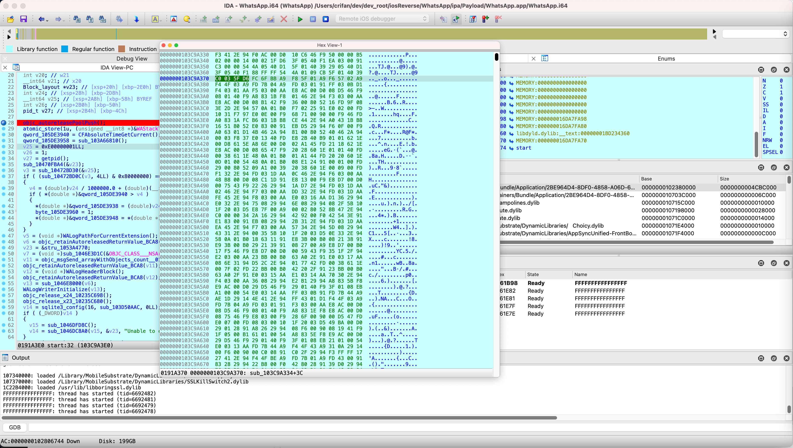
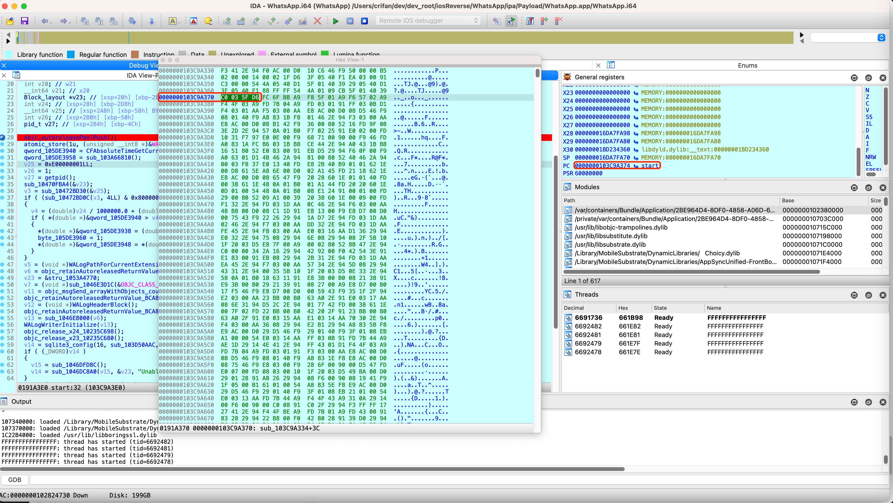
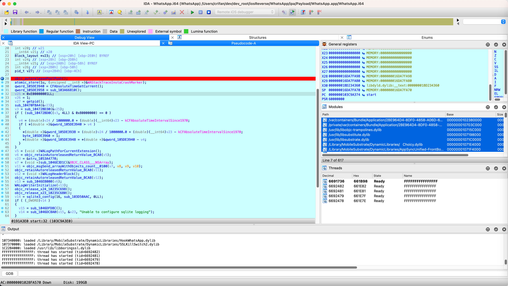
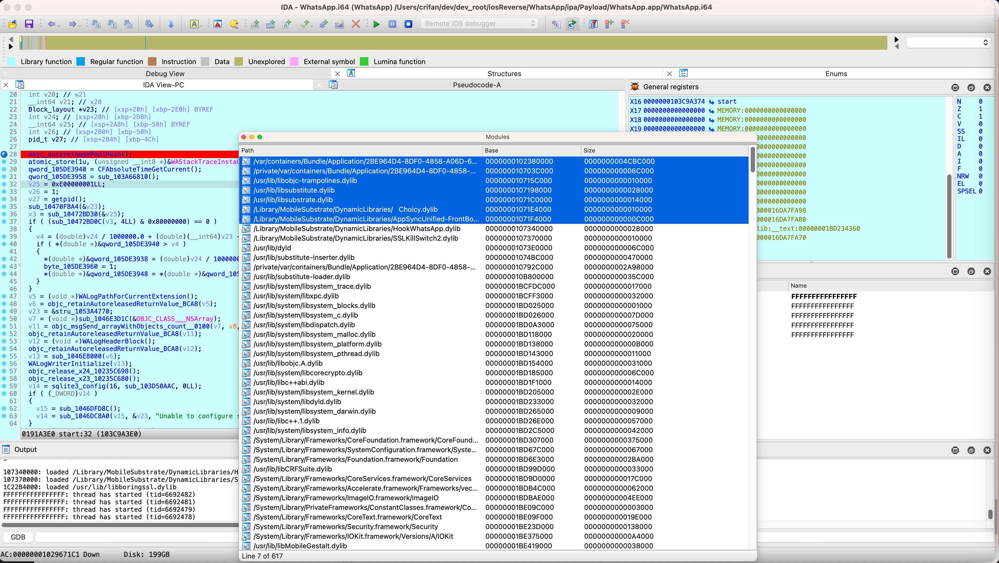
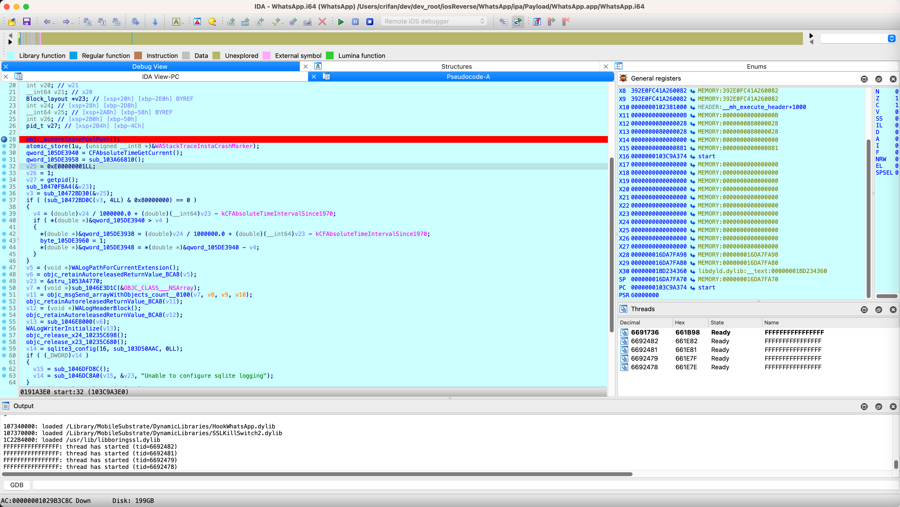

# 调试界面

之前给：IDA的汇编和F5伪代码，都加了断点：

断点的函数名是：入口函数start

此处进来后，默认进入：

伪代码中的断点：



## IDA View-PC

点击 IDA View-PC，切换到：

IDA汇编，可以看到之前给汇编加的断点：



## 相关log

IDA左下角的最后一部分的log是：

```log
insider the segment '__objc_const' as read-only
because the segment has the write permission
The decompiler did not consider the segment '__objc_data' as read-only
because the segment has the write permission
102380000: process /var/containers/Bundle/Application/2BE964D4-8DF0-4858-A06D-66CA8741ACDC/WhatsApp.app/WhatsApp has started (pid=4294967294)
shared cache mapping: 1BCFA0000..1F8D24000
shared cache mapping: 1FAD24000..2067E8000
shared cache mapping: 2087E8000..2112E8000
10703C000: loaded /private/var/containers/Bundle/Application/2BE964D4-8DF0-4858-A06D-66CA8741ACDC/WhatsApp.app/Frameworks/libswift_Concurrency.dylib
1074BC000: loaded /usr/lib/substitute-inserter.dylib
10792C000: loaded /private/var/containers/Bundle/Application/2BE964D4-8DF0-4858-A06D-66CA8741ACDC/WhatsApp.app/Frameworks/SharedModules.framework/SharedModules
1BCFDC000: loaded /usr/lib/system/libsystem_trace.dylib
1BCFF3000: loaded /usr/lib/system/libxpc.dylib
1BD025000: loaded /usr/lib/system/libsystem_blocks.dylib
...
1F4CEC000: loaded /System/Library/PrivateFrameworks/AppSSO.framework/AppSSO
1F4D1F000: loaded /System/Library/PrivateFrameworks/CPAnalytics.framework/CPAnalytics
1F5483000: loaded /usr/lib/swift/libswiftCoreML.dylib
1F549F000: loaded /usr/lib/swift/libswiftSpeech.dylib
1074BC000: loaded /usr/lib/substitute-inserter.dylib
gdb>objc[41732]: Class WADocumentAttachmentStats is implemented in both /private/var/containers/Bundle/Application/2BE964D4-8DF0-4858-A06D-66CA8741ACDC/WhatsApp.app/Frameworks/SharedModules.framework/SharedModules (0x10928d0c8) and /private/var/containers/Bund
gdb>le/Application/2BE964D4-8DF0-4858-A06D-66CA8741ACDC/WhatsApp.app/WhatsApp (0x105979e10). One of the two will be used. Which one is undefined.
objc[41732]: Class WAChatSearchBarCatalyst is implemented in both /private/var/containers/Bundle/Application/2BE9
gdb>64D4-8DF0-4858-A06D-66CA8741ACDC/WhatsApp.app/Frameworks/SharedModules.framework/SharedModules (0x1092b2720) and /private/var/containers/Bundle/Application/2BE964D4-8DF0-4858-A06D-66CA8741ACDC/WhatsApp.app/WhatsApp (0x105979fe0). One of the two will be use
gdb>d. Which one is undefined.

10715C000: loaded /usr/lib/libobjc-trampolines.dylib
107198000: loaded /usr/lib/libsubstitute.dylib
10B800000: loaded /usr/lib/substitute-loader.dylib
1071C0000: loaded /usr/lib/libsubstrate.dylib
1071E4000: loaded /Library/MobileSubstrate/DynamicLibraries/   Choicy.dylib
1071F4000: loaded /Library/MobileSubstrate/DynamicLibraries/AppSyncUnified-FrontBoard.dylib
gdb>SubstituteLog: Attempted to hook non-existant selector "trustStateForApplication:" in class "nil"
SubstituteLog: Attempted to hook non-existant selector "trustStateWithTrustRequiredReasons:" in class "nil"
SubstituteLog: Attempted to hook non-existant se
gdb>lector "trustState" in class "nil"

107340000: loaded /Library/MobileSubstrate/DynamicLibraries/HookWhatsApp.dylib
107370000: loaded /Library/MobileSubstrate/DynamicLibraries/SSLKillSwitch2.dylib
1C22B4000: loaded /usr/lib/libboringssl.dylib
FFFFFFFFFFFFFFFF: thread has started (tid=6692482) 
FFFFFFFFFFFFFFFF: thread has started (tid=6692481) 
FFFFFFFFFFFFFFFF: thread has started (tid=6692479) 
FFFFFFFFFFFFFFFF: thread has started (tid=6692478)
```

发现并没有太多的界面，可供查看？

## Stack View

点击部分窗口，变成浮动窗口，看看效果：



```bash
000000016DA7FA70  00000001BD234360  libdyld.dylib:__text:00000001BD234360
000000016DA7FA78  0000000000000000  MEMORY:unk_0
000000016DA7FA80  0000000000000000  MEMORY:unk_0
000000016DA7FA88  0000000000000000  MEMORY:unk_0
000000016DA7FA90  0000000000000000  MEMORY:unk_0
000000016DA7FA98  0000000102380000  HEADER:__mh_execute_header
000000016DA7FAA0  0000000000000001  MEMORY:unk_1
000000016DA7FAA8  000000016DA7FBF0  MEMORY:000000016DA7FBF0
000000016DA7FAB0  0000000000000000  MEMORY:unk_0
000000016DA7FAB8  000000016DA7FC4E  MEMORY:000000016DA7FC4E
000000016DA7FAC0  000000016DA7FC5A  MEMORY:000000016DA7FC5A
000000016DA7FAC8  000000016DA7FC69  MEMORY:000000016DA7FC69
000000016DA7FAD0  0000000283A2C000  MEMORY:0000000283A2C000
000000016DA7FAD8  0000000283528000  MEMORY:0000000283528000
000000016DA7FAE0  000000016DA7FD4D  MEMORY:000000016DA7FD4D
000000016DA7FAE8  000000016DA7FD5B  MEMORY:000000016DA7FD5B
000000016DA7FAF0  000000016DA7FD6E  MEMORY:000000016DA7FD6E
000000016DA7FAF8  0000000283A2C070  MEMORY:0000000283A2C070
000000016DA7FB00  000000016DA7FDF0  MEMORY:000000016DA7FDF0
000000016DA7FB08  000000028132C0B0  MEMORY:000000028132C0B0
000000016DA7FB10  0000000000000000  MEMORY:unk_0
000000016DA7FB18  0000000000000000  MEMORY:unk_0
000000016DA7FB20  0000000000000000  MEMORY:unk_0
000000016DA7FB28  000000016DA7FB80  MEMORY:000000016DA7FB80
000000016DA7FB30  000000016DA7FEA8  MEMORY:000000016DA7FEA8
000000016DA7FB38  000000016DA7FEBF  MEMORY:000000016DA7FEBF
000000016DA7FB40  000000016DA7FED0  MEMORY:000000016DA7FED0
000000016DA7FB48  000000016DA7FEEF  MEMORY:000000016DA7FEEF
000000016DA7FB50  000000016DA7FF24  MEMORY:000000016DA7FF24
000000016DA7FB58  000000016DA7FF40  MEMORY:000000016DA7FF40
000000016DA7FB60  000000016DA7FF74  MEMORY:000000016DA7FF74
000000016DA7FB68  000000016DA7FF9B  MEMORY:000000016DA7FF9B
000000016DA7FB70  000000016DA7FFBE  MEMORY:000000016DA7FFBE
000000016DA7FB78  0000000000000000  MEMORY:unk_0
000000016DA7FB80  6261747563657865  MEMORY:6261747563657865
000000016DA7FB88  3D687461705F656C  MEMORY:3D687461705F656C
000000016DA7FB90  6E6F632F7261762F  MEMORY:6E6F632F7261762F
000000016DA7FB98  2F7372656E696174  MEMORY:2F7372656E696174
000000016DA7FBA0  412F656C646E7542  MEMORY:412F656C646E7542
000000016DA7FBA8  69746163696C7070  MEMORY:69746163696C7070
000000016DA7FBB0  36394542322F6E6F  MEMORY:36394542322F6E6F
000000016DA7FBB8  304644382D344434  MEMORY:304644382D344434
000000016DA7FBC0  30412D383538342D  MEMORY:30412D383538342D
000000016DA7FBC8  38414336362D4436  MEMORY:38414336362D4436
...
```

结果操作一下：都是`?`了：



## Hex View

去看看：

* `Hex View-1`
  * 
    * 好像也看不出啥

后来发现了：



此处是以hex的16进制，查看二进制的原始数据

此处PC在：

* 入口函数：start
  * 地址：0000000103C9A374

是对得上的。

但是貌似Hex模式也没太多用。关闭。

## Modules

去选择Modules：



且可以复制出内容：

```bash
/var/containers/Bundle/Application/2BE964D4-8DF0-4858-A06D-66CA8741ACDC/WhatsApp.app/WhatsApp    0000000102380000    0000000004CBC000
/private/var/containers/Bundle/Application/2BE964D4-8DF0-4858-A06D-66CA8741ACDC/WhatsApp.app/Frameworks/libswift_Concurrency.dylib    000000010703C000    000000000006C000
/usr/lib/libobjc-trampolines.dylib    000000010715C000    0000000000010000
/usr/lib/libsubstitute.dylib    0000000107198000    0000000000028000
/usr/lib/libsubstrate.dylib    00000001071C0000    0000000000014000
/Library/MobileSubstrate/DynamicLibraries/   Choicy.dylib    00000001071E4000    0000000000010000
/Library/MobileSubstrate/DynamicLibraries/AppSyncUnified-FrontBoard.dylib    00000001071F4000    000000000000C000
。。。
```

拖动已变成浮动窗口：



不过后续调试期间也很少用得到Modules，所以也可以去关闭了。

目前的IDA中调试iOS的app的效果是：


