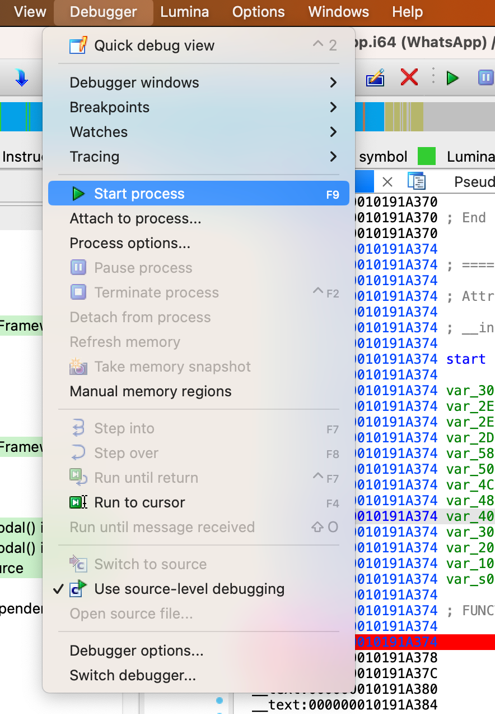
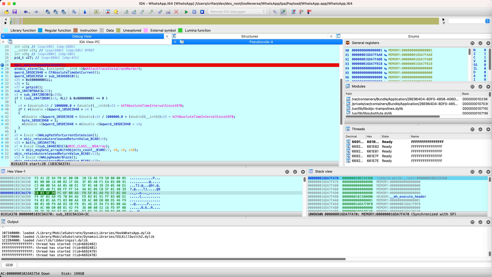

# 搭建环境

此处IDA中初始化调试iOS的app：WhatsApp的过程是：

## 获取二进制完整路径

参考：

[二进制文件路径 · iOS逆向：心得集锦](https://book.crifan.org/books/ios_re_experience_collection/website/ios_app/bin_path.html)

此处去用CocoaTop/爱思助手等，获取到二进制路径：

* iOS的app：WhatsApp
  * 主二进制（在iPhone7中）的完整路径
    * `/var/containers/Bundle/Application/2BE964D4-8DF0-4858-A06D-66CA8741ACDC/WhatsApp.app/WhatsApp`

## 先（给某个函数）加断点

此处选择入口函数：

WhatsApp的入口函数是：`start`

可以在IDA的`Exports`中找到：

```
start    000000010191A374    [main entry]
```

对应的地址：`0x10191A374`


双击进入IDA汇编代码，加上断点：


注：

F5伪代码，也是可以加断点的：


## 设置debugger调试器：`Remote iOS Debugger`

`IDA`->`Debugger`->`Select debugger`->`Remote iOS debugger`


## 设置进程选项

`IDA`->`Debugger`->`Process options`->给：

* Application和Input File都设置为：WhatsApp的二进制完整路径
  * `/var/containers/Bundle/Application/2BE964D4-8DF0-4858-A06D-66CA8741ACDC/WhatsApp.app/WhatsApp`


注：

点击Help，可以查看参数含义解释：


## 设置调试器选项

`IDA`->`Debugger`->`Debugger options`->`Set specific options`->`iOS configuration`

* `Max packet size`: `512`
  * 注：默认值-1，暂不太清楚具体含义
* `Timeout`：`1000`
* `Symbol path`: `/Users/crifan/Library/Developer/Xcode/iOS DeviceSupport/13.3.1 (17D50)/Symbols`
  * 可以从`~/Library/Developer/Xcode/iOS DeviceSupport`找到具体的和你的iPhone设备匹配的上述路径
* `Device`：`iPhone7_1331 (iPhone 7, iOS 13.3.1)`
  * 默认已识别和选择当前USB连接到Mac的iPhone设备
  * （默认已）勾选：`Launch debugserver automatically`


## 启动调试

* 有2种方式启动：
  * Spawn模式
    * `IDA`->`Debugger`->`Start process`
      * 
  * Attach模式
    * `IDA`->`Debugger`->`Attach to process`

后续即可启动，大概过程是：

* `Running`
* `Importing Symbols`
  * 此处，此阶段像卡死了
    * 最终耗时10分钟才解析符号结束
      * 估计是符号表=函数太多，导致的？

然后就进去了IDA调试主界面：



对应的，电脑+手机的总体效果：


后续即可愉快的调试了。

## 附录

### 参考资料

* 网友的
  * [[iOS Hacker] IDA 7.0 动态调试 iOS App – exchen's blog](https://www.exchen.net/ida-70-ios-debugger.html)
* 官网的
  * 新
    * [Tutorial: Debugging iOS Applications with IDA Pro (hex-rays.com)](https://www.hex-rays.com/wp-content/static/tutorials/ios_debugger_primer2/ios_debugger_primer2.html)
      * Debugging iOS Applications with IDA Pro
      * Debugging DYLD
      * Debugging the DYLD Shared Cache
      * Debugging System Applications
      * Troubleshooting
    * 旧
      * https://www.hex-rays.com/wp-content/uploads/2019/12/ios_debugger_tutorial.pdf
