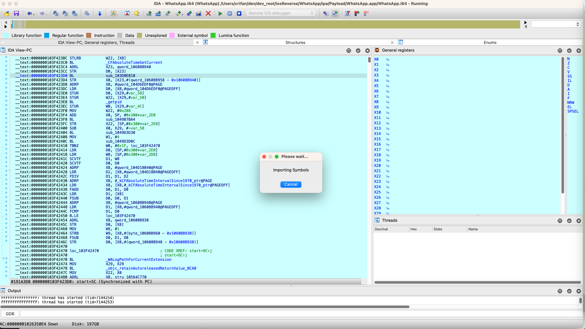
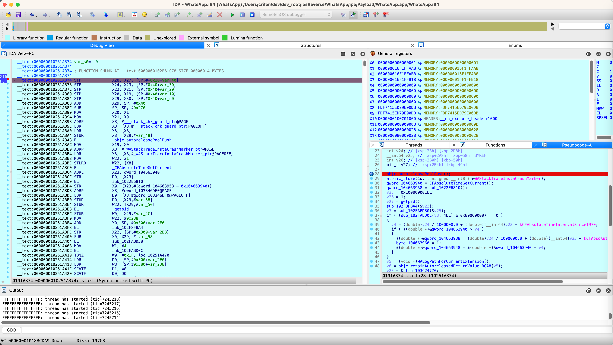
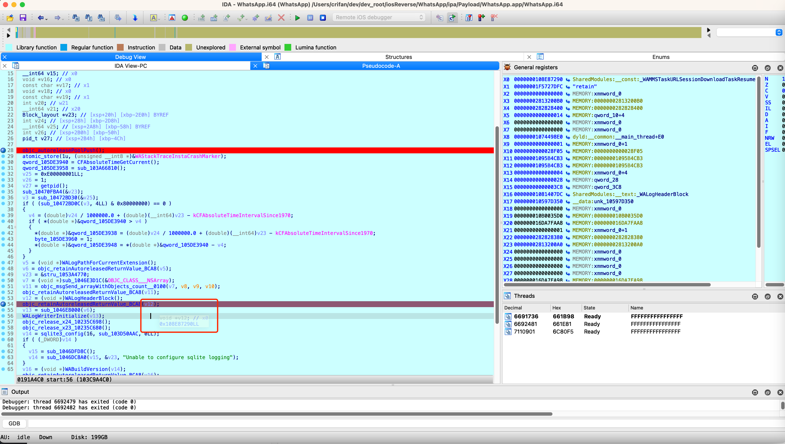
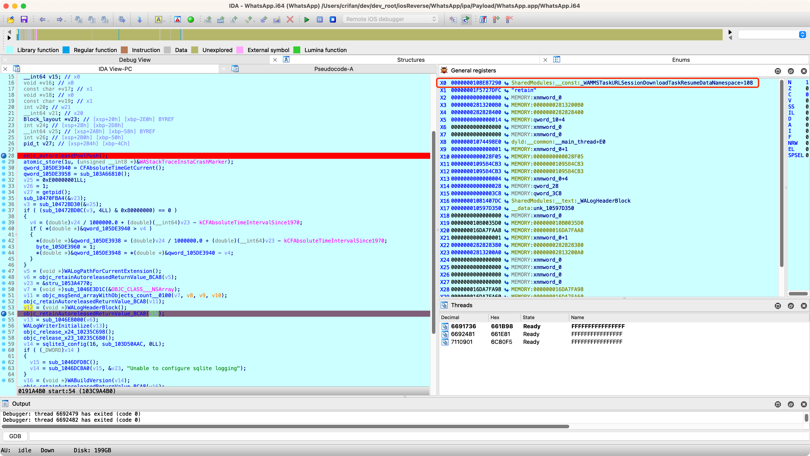

# 常见问题

## IDA调试iOS

### 每次调试启动太耗时

* IDA调试iOS的app：WhatsApp
  * 每次调试，都会
    * Importing Symbols导入符号：耗时10分钟左右
      * 
    * 自动分析：耗时很久
      * 

-》导致每次调试都要等待很长时间：平均要半小时以上

-》导致IDA调试iOS的app：效率太低，不方便，几乎不可用

### 无法类似lldb的po打印出对象信息

此处IDA调试iOS的app：WhatsApp

虽然可以鼠标移动到变量上，能查看到16进制=二进制的值

但是希望实现：

Xcode中lldb的po查看到的类的值

比如：

继续给下面某行：

```c
  v12 = (void *)WALogHeaderBlock();
  objc_retainAutoreleasedReturnValue_BCA8(v12);
```

加了断点。

继续运行后，此时：



按道理：

v12是个Block类型

希望能像Xcode中lldb，去po查看出是Block

但是此时只能看到16进制的值

且还不方便复制，只能手动写出来：

0x108E87290

不过此处巧了，是x0寄存器的值

所以，寄存器窗口，倒是可以看到对应的值：



且：好像可以解析出是SharedModules中const常量

但是显示的内容，也不是Block

然后经过一番尝试，最终还是：

IDA调试iOS的app中，无法像（Xcode中）lldb去`po`查看出类=对象的信息

---

TODO：

有机会，可以去参考：

[simulator the lldb command like "po objc_object" inside the IDA debugger. (github.com)](https://gist.github.com/jhftss/6eb01f83377d909ea3dfb155cef4e08d)

去借鉴别人的脚本，自己实现：`po xxx`的效果

---
