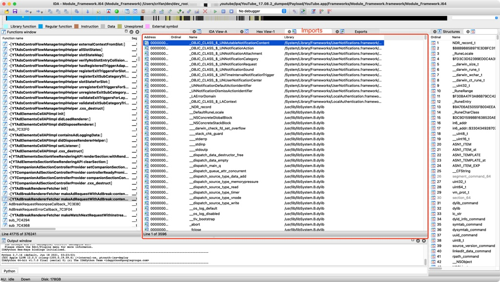
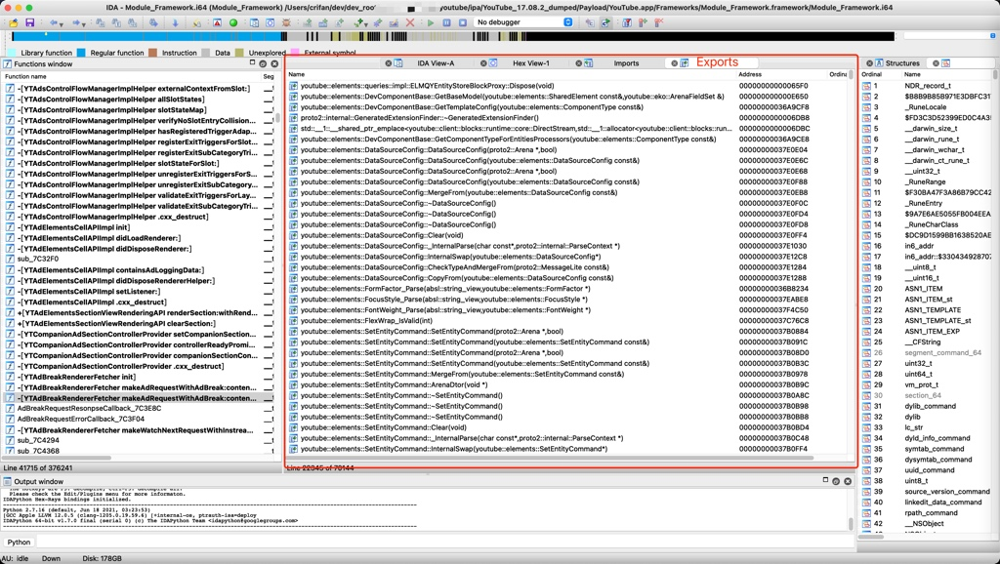

# 导入和导出

IDA中还有2个独立的窗口是：

* Import=导入
  * 当前二进制，导入了哪些函数
    * = 引用了外部的，别的库的哪些函数
  * 举例
    * 
* Export=导出
  * 当前二进制，导出了哪些函数
    * 供别处（比如自己程序的另外的二进制中去）使用
  * 举例
    * 

在逆向分析时，可以根据，导出和导出，找到一些相关线索

比如，在iOS逆向的越狱检测和反越狱检测中，就可以去找，当前二进制是否导入了，常用于越狱检测的一些系统函数。

详见：

【整理Book】iOS逆向开发：越狱检测和反越狱检测
