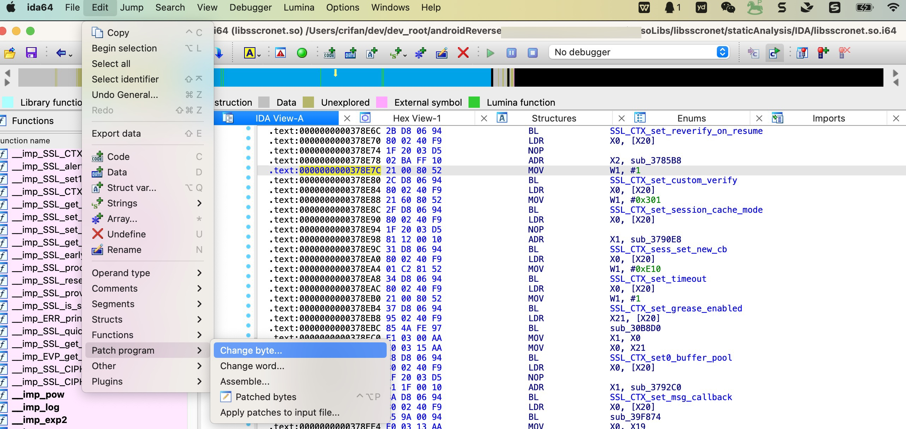
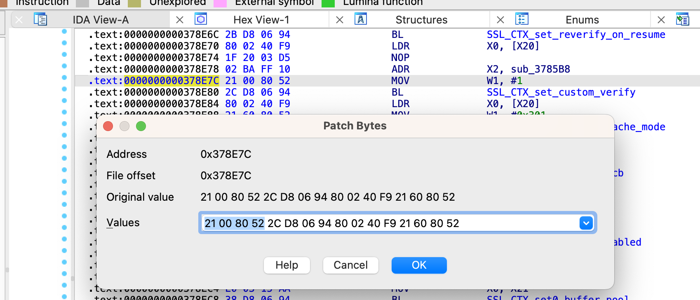
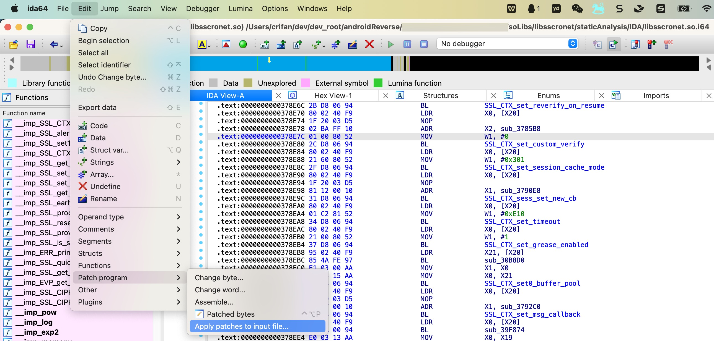
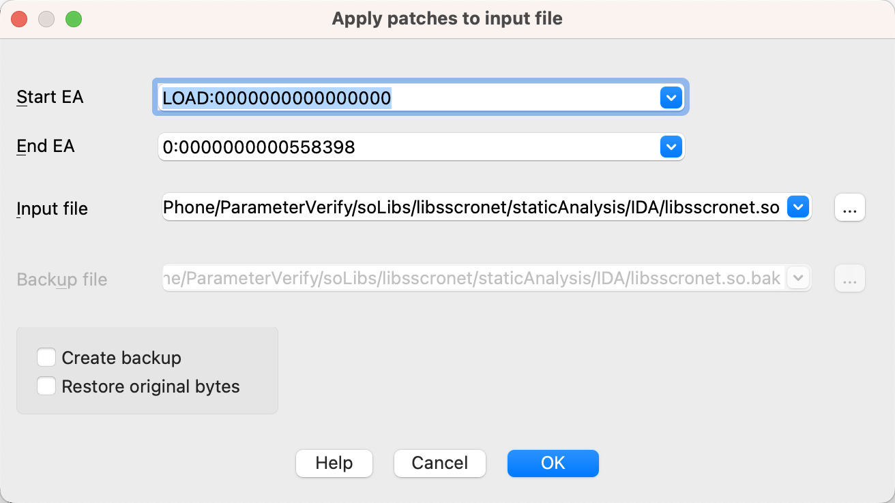
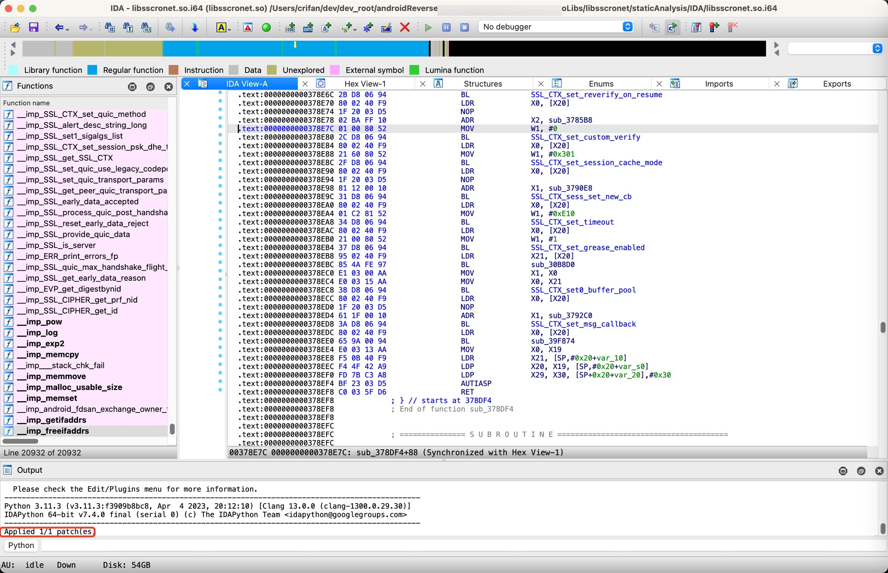

# 打补丁

IDA还支持**打补丁**=**修改程序的二进制文件**

下面详细介绍：

IDA中打patch=打补丁=修改二进制 的步骤：

* 鼠标点击所在要修改的位置
  * 注：只有鼠标事先点击到了，要修改内容，要打补丁的位置，到时候弹框显示出来的内容，才是我们要修改的内容
* `IDA`->`Edit`->`Patch program`->`Change byte`
  * 
* 显示`Patch Bytes`弹框
  * 
* 然后去修改对应的数据
  * 举例
    * `0x378E7C`
      * 从`Origin value`：
        * **21 00 80 52** 2C D8 06 94 80 02 40 F9 21 60 80 52
          * 注：此处其实一般只需要修改4个字节，但是默认会显示出16个字节的数据，所以此时后续12个字节的数据，往往保留不变即可
      * 修改 Values 为：
        * **01 00 80 52** 2C D8 06 94 80 02 40 F9 21 60 80 52
      * 即：把第一个字节的`0x21`修改为`0x01`，即可
* 点击OK，真正修改
* 最终记得保存（到原始二进制中）：
  * `IDA`->`Edit`->`Patch program`->`Apply patches to input file`->`OK`
    * 
    * 
      * 注：
        * 如果需要额外备份，则勾选：`Create backup`
    * 
      * 注：
        * 保存后：底部会显示log：
          * `Applied 1/1 patch(es)`
