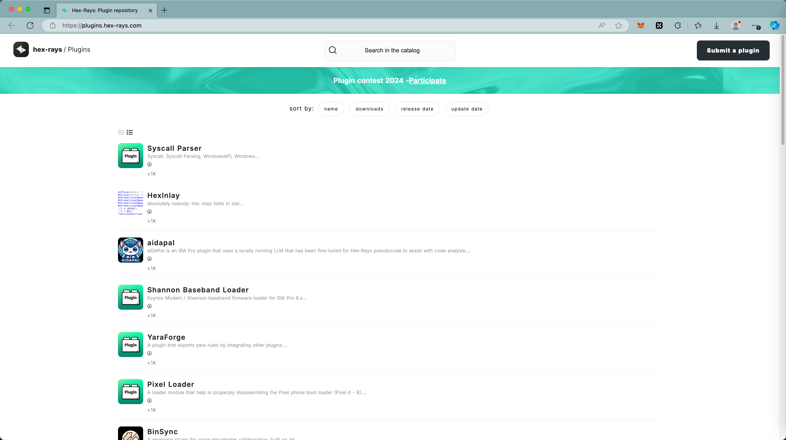
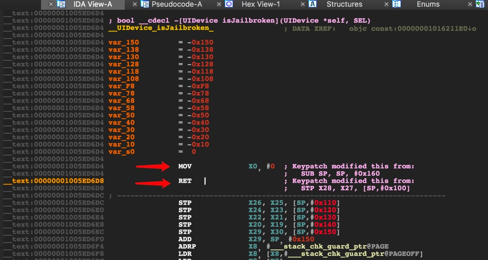

# 插件

IDA还支持插件的机制，可以扩展支持更多更强的各种功能。

## 插件机制

* IDA插件
  * 概述
    * IDA支持插件机制
  * 作用
    * 通过写代码，实现特定功能
      * 举例
        * 写代码，增强对对恶意代码的分析
        * 提取Mach-O中的ObjC的符号表
  * 具体实现
    * 支持多种语言
      * `Python`
        * 详见
          * [子教程](../sub_tutorial/README.md)中提到的
            * [IDA插件脚本：IDAPython](https://book.crifan.org/books/ida_plugin_script_idapython/website)
      * `C++`
  * 官网文档
    * [Plugins | Hex-Rays Docs](https://docs.hex-rays.com/user-guide/plugins)
      * 如何写插件 == [How to write your own plugin? | Hex-Rays Docs](https://docs.hex-rays.com/user-guide/plugins/how-to-write-your-own-plugin)
        * 用Python（库：IDAPython）写插件
          * [How to create a plugin in IDAPython? | Hex-Rays Docs](https://docs.hex-rays.com/developer-guide/idapython/how-to-create-a-plugin)
        * 用C++写插件
          * [How to write your own plugin? | Hex-Rays Docs](https://docs.hex-rays.com/developer-guide/c++-sdk/how-to-create-a-plugin)
  * 官网插件库
    * [Hex-Rays: Plugin repository](https://plugins.hex-rays.com/)
      * 

## 常用插件

常见的插件有：

* stealth
* findcrypt
* highlighter
* unispector
* keypatch
  * 有机会参考
    * [iOS重打包绕过签名校验防护 | La0s](https://la0s.github.io/2019/03/21/iOS_Resign/)
  * > 使用Keypatch插件patch两条汇编`MOV X0, #0` && `RET`
    * 
  * 去试试：
    * 用keypatch插件，patch打补丁，插入（汇编）指令

### 其他插件

* 网上别人整理的IDA插件
  * [onethawt/idaplugins-list: A list of IDA Plugins](https://github.com/onethawt/idaplugins-list)
