# 汇编代码

IDA中的`汇编代码`，是从原始二进制的字节码，反汇编得到的汇编代码

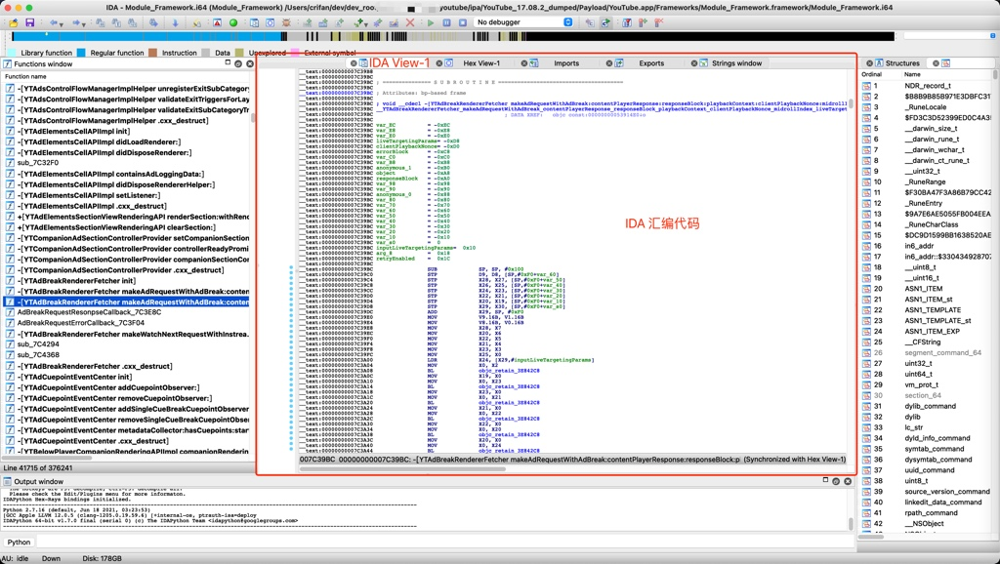

* 一般来说，在逆向尝试搞懂代码逻辑时，不太需要直接查看汇编代码，因为的确很难直接看懂逻辑。
  * 不过，有时候也是可以通过调试，看懂部分汇编代码的逻辑的，比如：
    * [从汇编反推代码逻辑 · iOS逆向：心得集锦](https://book.crifan.org/books/ios_re_experience_collection/website/common/understand_asm_logic.html)

不过有些情况下，会用到汇编代码：

* iOS逆向
  * 静态分析
    * 有些汇编代码中，IDA已帮忙分析和插入了相关的解释信息，值得研究逻辑时去参考
      * 比如，YouTube逆向期间，IDA已帮忙给相关汇编加上了描述，指明了有些代码是vtable的部分
        * 便于分析和对照，寻找对应虚函数的具体实现
  * 动态调试
    * 想要找到调试期间的，Xcode中汇编代码，对应的代码逻辑
      * 往往就需要找到IDA中对应的伪代码是什么
        * 往往就需要先去找到IDA中汇编代码的位置
          * 再去F5（或Tab键）跳转到对应的伪代码的位置

## IDA中显示Opcode

IDA中对于显示汇编代码时，默认：没有显示`opcode`

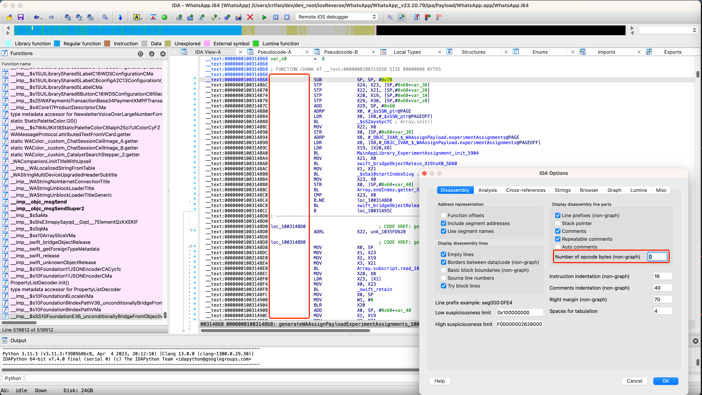

然后去设置中可以开启显示opcode，且可以指定显示几个字节的opcode

比如设置为`4`：

* `IDA`->`Options`->`General`->`IDA Options`->`Disassembly`->`Display disassembly line parts`
  * `Number of opcode bytes(non-graph)`: `4`

效果是：

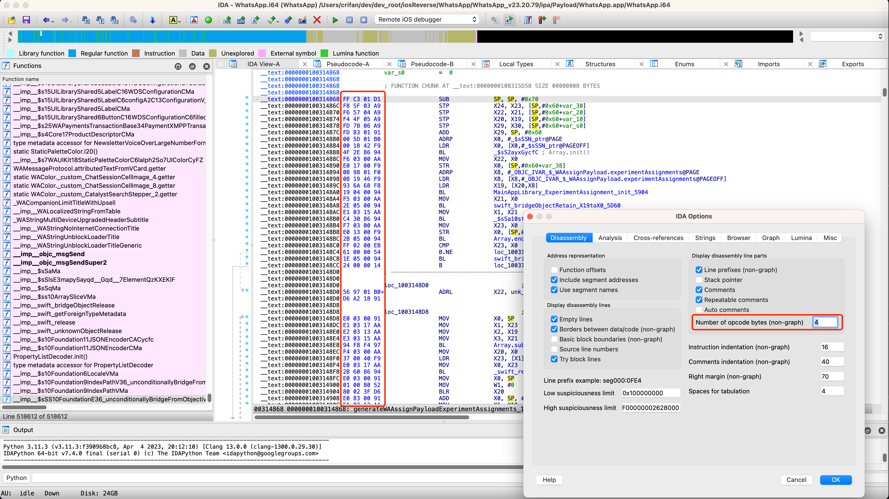

## IDA中是否开启：自动注释

对于IDA中汇编代码，可以选择：是否开启`自动注释`

默认是：没有开启`自动注释`=`Auto comments`

效果是：

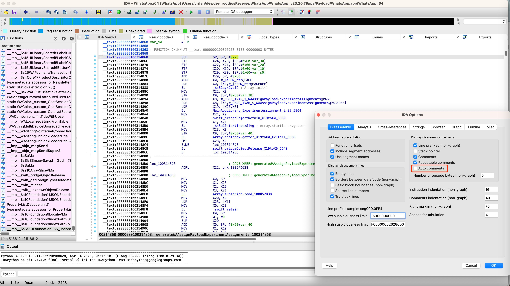

可以选择去开启：

* `IDA`->`Options`->`General`->`IDA Options`->`Disassembly`->`Display disassembly line parts`
  * 勾选：`Auto comments`

效果是：

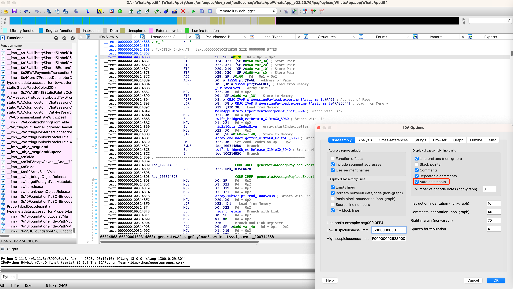

-》

自动给各个汇编代码，加上了注释

注释内容，主要是：汇编指令的含义概述

## IDA汇编代码如何快速找到匹配的Xcode汇编代码

* 背景
  * iOS逆向调试期间，Xcode去调试汇编代码期间，正在调试某行汇编代码
* 需求
  * 想要找到Xcode正在调试的汇编代码，所对应的IDA中是哪行汇编代码，以及IDA中对应的伪代码是什么，目的是搞懂对应伪代码的大概的代码逻辑，便于尽快辅助的搞懂代码逻辑
* 方法
  * 概述
    * 看Xcode中的汇编和IDA中的汇编的地址最后几位（2位或3位），即可快速对应出代码的位置

详解：

### 举例

#### 举例1

从某app的IDA伪代码

292行

```c
      v52 = j__objc_msgSend(v51, (const char *)qword_38B4188, curDict, v4);
```

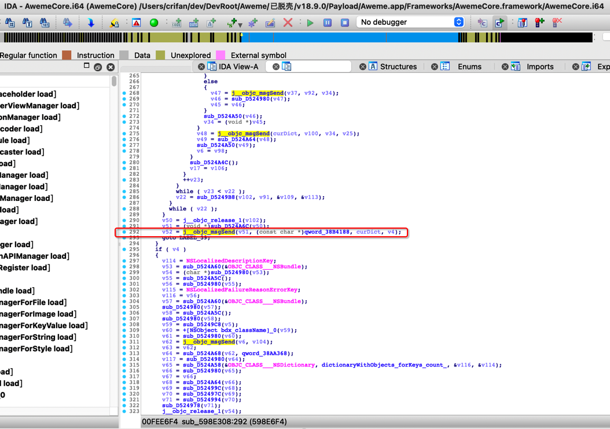

通过Tab键，找到了IDA汇编代码：

```asm
__text:000000000598E6F4                 BL              j__objc_msgSend
```

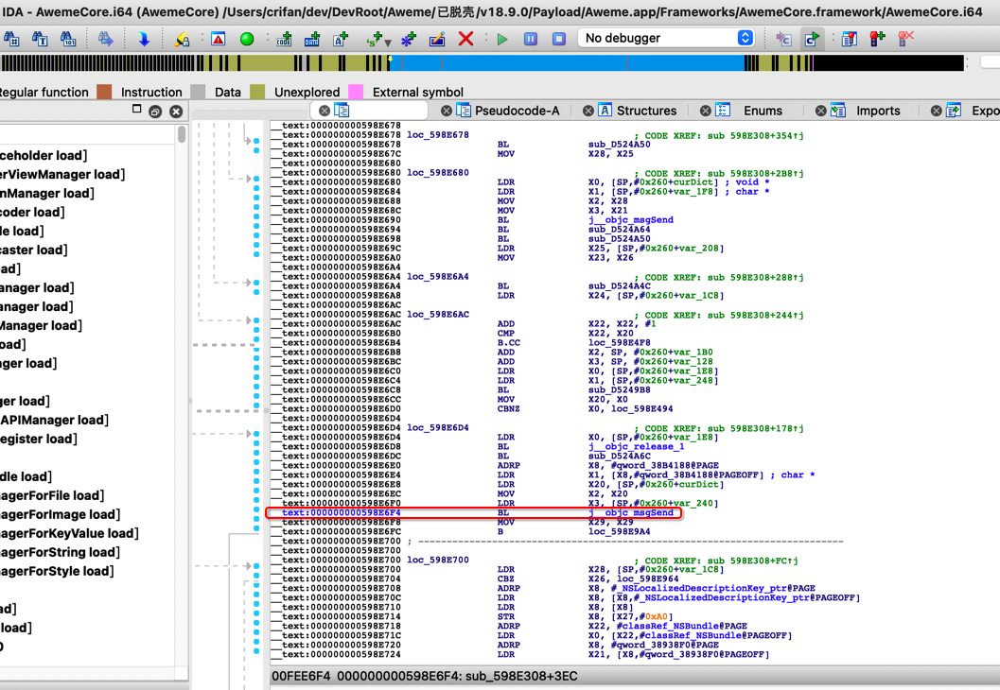

此处，不是十分确定，是不是一定对应着，正在调试的，Xcode汇编代码：

```asm
    0x108a0a6f4 <+1004>: bl     0x11059feec              ; ___lldb_unnamed_symbol1189160$$AwemeCore
```

不过其实通过去计算偏移量算出IDA汇编代码的偏移量，和Xcode中显示的+1004，对得上，其实就能判断出来。

不过此处，注意到一个细节，可以快速辅助帮忙确认是否匹配上：

汇编代码的地址的最后2位或最后3位：

IDA汇编代码 和 Xcode汇编代码 的最后2或3位 是一样的

就表示匹配上了：

Xcode汇编代码：

```asm
    0x108a0a6ec <+996>:  mov    x2, x20
    0x108a0a6f0 <+1000>: ldr    x3, [sp, #0x20]
    0x108a0a6f4 <+1004>: bl     0x11059feec              ; ___lldb_unnamed_symbol1189160$$AwemeCore
```

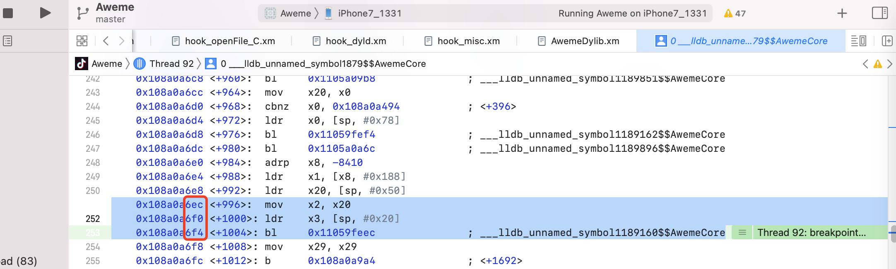

-》前后几行汇编的最后几位是：

* 6ec
* 6f0
* 6f4

而IDA汇编代码，前后几行：

```asm
__text:000000000598E6EC                 MOV             X2, X20
__text:000000000598E6F0                 LDR             X3, [SP,#0x260+var_240]
__text:000000000598E6F4                 BL              j__objc_msgSend
```

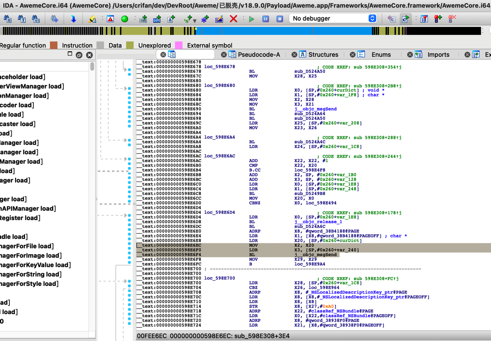

的最后几位：

* 6EC
* 6F0
* 6F4

分别都是对得上的。

其背后机制是：

* 二进制内的偏移量，相同代码，则肯定是相同的
* 二进制=动态库 的基地址=ALSR虽然是变化的
  * 但是ALSR的基地址（一般）肯定是整数倍，至少最后很多位是0

所以最后的地址，最后几位，此处是3位，肯定都是一样的（虽然ALSR起始地址不同）

因此，可以通过最后3位的地址值，对得上，确定就是代码匹配上，对应得上的。

#### 举例2

IDA伪代码：

288行的

```c
                v50 = j__objc_msgSend(curDict, setObjectForKeyedSubscript, curDictValue, curDictKey);
```

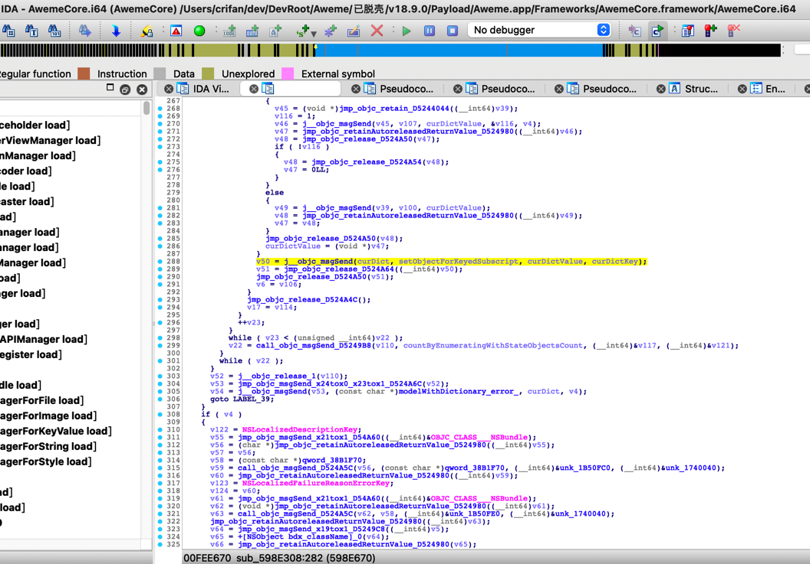

Tab键后，找到相关部分的代码：

```asm
__text:000000000598E67C                 MOV             X28, X25
__text:000000000598E680
__text:000000000598E680 loc_598E680                             ; CODE XREF: sub_598E308+2B8↑j
__text:000000000598E680                 LDR             X0, [SP,#0x260+curDict] ; void *
__text:000000000598E684                 LDR             X1, [SP,#0x260+setObjectForKeyedSubscript] ; char *
__text:000000000598E688                 MOV             X2, X28
__text:000000000598E68C                 MOV             X3, X21
__text:000000000598E690                 BL              j__objc_msgSend
```

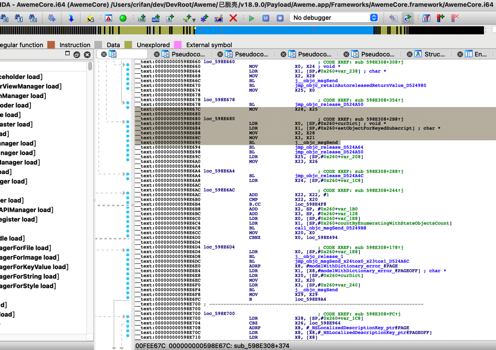

然后再去找：

IDA汇编 -> Xcode汇编

即可从找几行连续的，汇编地址的末尾3位

比如：

* 688
* 68C
* 690

即可回头找到Xcode中对应的代码位置：

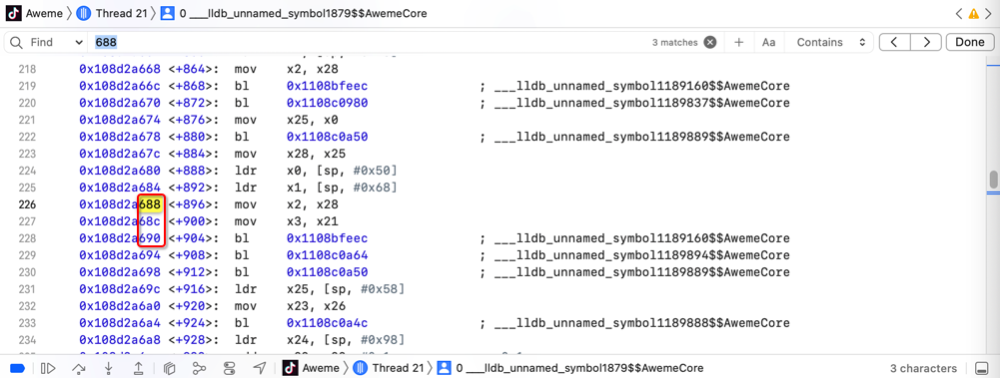

从而找到 对应代码段：

```asm
    0x108d2a67c <+884>:  mov    x28, x25
    0x108d2a680 <+888>:  ldr    x0, [sp, #0x50]
    0x108d2a684 <+892>:  ldr    x1, [sp, #0x68]
    0x108d2a688 <+896>:  mov    x2, x28
    0x108d2a68c <+900>:  mov    x3, x21
    0x108d2a690 <+904>:  bl     0x1108bfeec              ; ___lldb_unnamed_symbol1189160$$AwemeCore
```

效果很好。

就不用麻烦的计算偏移量，即可快速找到：

* IDA中
  * 汇编代码
  * 伪代码
* Xcode中
  * 汇编代码

的相互对应的位置了。

-》便于快速定位代码位置，辅助尽快搞懂代码逻辑。
