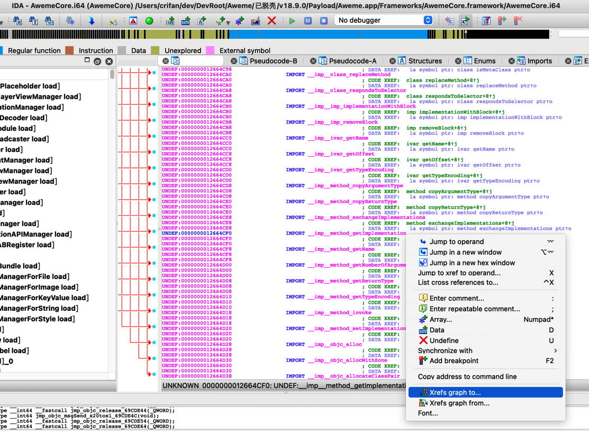
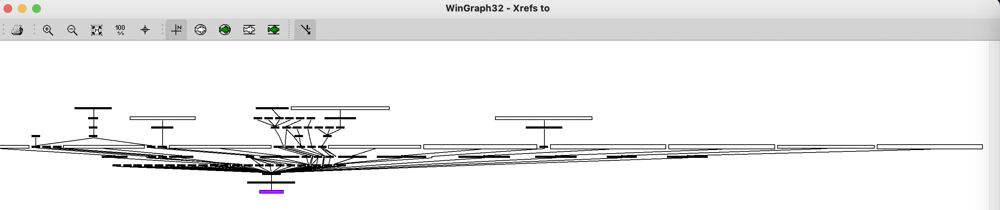
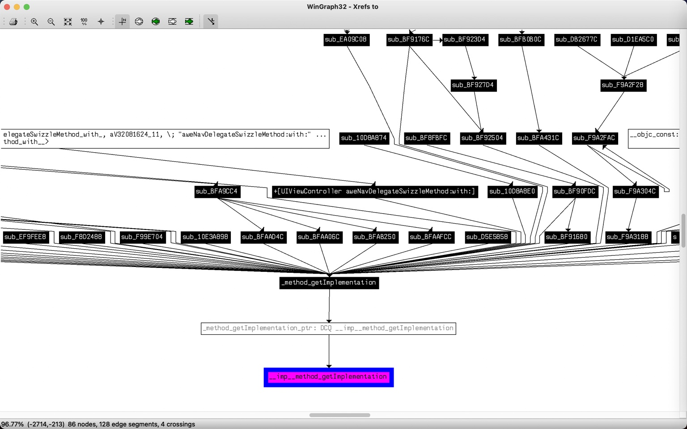
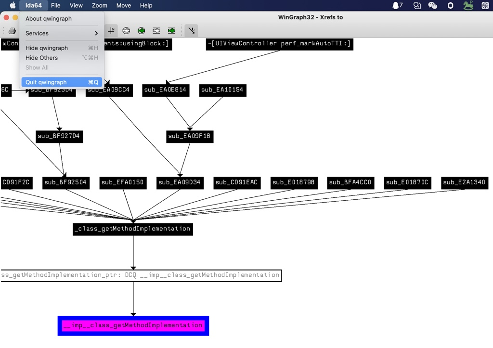
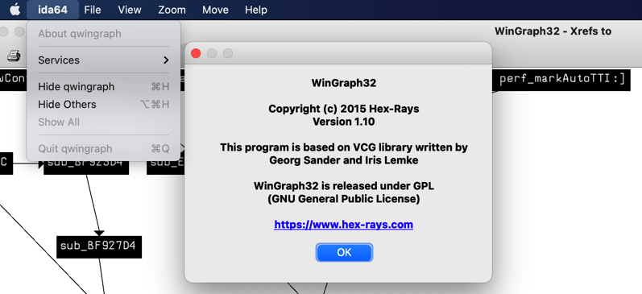

# 函数调用

TODO：

* 【整理】iOS逆向心得：IDA中以列表形式列出函数被调用的地方
  * 【整理】iOS逆向心得之IDA使用心得：查看函数被调用的所有的地方即被调用函数的列表
  * 【整理】iOS逆向心得之IDA使用心得：如何快速找到真正的函数的被调用的列表函数名
* 【整理】IDA 使用心得：交叉引用以列表方式显示
* 【已解决】研究抖音Hook检测：调用到method_getImplementation的地方

---

IDA中代码分析方面，对于函数的调用的关系，也有很好的支持。

iOS逆向期间，往往涉及到，想要搞懂一个函数，被其他哪些地方调用到了等等，和函数调用关系相关的内容。IDA对此支持的都很好。

* 函数调用
  * 效果举例
    * Xrefs graph to
      * 
      * 
      * 

## Xrefs to=有哪些地方引用到了此函数

### 显示界面的底层实现所用的库

IDA中函数调用的graph，通过`ida64`的quit，看到的是：`qwingraph`



而`qwingraph`，其实是一个插件，底层可视化插件

可以从

[Download center (hex-rays.com)](https://hex-rays.com/download-center/)

找到：

* Qwingraph v1.10
  * Source code the Wingraph we use and modified (GPL)
    * https://hex-rays.com/products/ida/support/freefiles/qwingraph_src.zip

而`WinGraph32`本身的`关于`的信息是：

```bash
WinGraph32

Copyright (c) 2015 Hex-Rays
Version 1.10

This program is based on VCG library written by Georg Sander and Iris Lemke

WinGraph32 is released under GPL (GNU General Public License)

https://www.hex-rays.com
```


