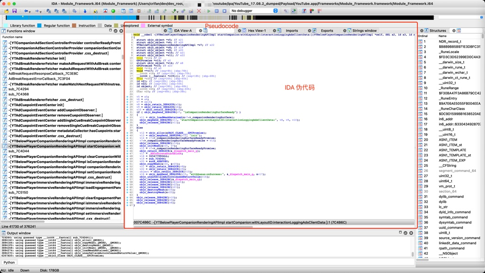

# 伪代码

TODO：

* 【未解决】IDA使用心得：伪代码内新增变量
* 【整理】IDA使用心得：刷新当前已打开的伪代码用F5
* 【整理】IDA使用心得：伪代码中的指针+某个数值和0x开头LL结尾的数值不是一个意思
* 【整理】IDA使用心得：给伪代码添加注释
* 【整理】IDA使用心得：伪代码中的可变参数个数的函数去增加或删除参数
* 【整理】iOS逆向心得：IDA使用心得：改变值的显示格式从10进制改为16进制查看Block的flags标志位
* 【整理】iOS逆向心得：IDA Pro使用心得：给函数改名便于快速定位汇编伪代码对应关系
* 【iOS逆向心得】IDA使用心得：伪代码中在修改了别处函数定义后返回导致伪代码中函数调用参数丢失
* 【整理】IDA使用心得：反编译伪代码常见错误
  * [Failures and troubleshooting (hex-rays.com)](https://www.hex-rays.com/products/decompiler/manual/failures.shtml)
* 【整理】IDA使用心得：如何理解反汇编后的伪代码的逻辑
* 【记录】IDA使用心得：objc_msgSend跳板函数重命名优化
* 【记录】IDA使用心得：伪代码改名重命名改回默认值
* 【记录】IDA使用心得：给伪代码的变量改名
* 【已解决】IDA使用心得：伪代码中如何找到对应的IDA汇编代码
* 【已解决】IDA中给汇编代码或伪代码改名
* 【整理】IDA使用心得：改名 给变量改类型
* 【整理】IDA使用心得：F5伪代码

代码逆向相关：

* 【已解决】IDA中xsp和xbp是什么意思如何定位地址
* 【整理】IDA使用心得：IDA伪代码和汇编代码 反汇编 逻辑关系 理解

---

IDA中，支持从`汇编代码`，按`F5`快捷键去`反编译`得到的`伪代码` -> 很接近人类写的代码，人类能容易读懂代码逻辑的代码

IDA中最强的功能，应该就属这个`伪代码`了。

IDA反编译出的`伪代码`：

* 质量很高：很接近原程序的代码的逻辑
* 且有很多额外好用的功能支持
  * 比如
    * 重命名：rename
    * 变量更改类型：change type
    * 增加减少参数个数
    * 自动解析出类的属性的引用
    * 等等

伪代码中，右键，支持很多功能：

* Rename
* Set type
* Set number representation
* Edit indented comment
* Edit block comment
* Hide/unhide statements
* Split/unsplit expression
* Force call type
* Set call type
* Add/del variadic arguments
* Del function argument
* Add/delete function return type
* Jump to cross reference
* Jump to cross reference globally
* Generate HTML file
* Mark/unmark as decompiled
* Copy to assembly
* Show/hide casts

而根据当前元素类型，（可能）会显示额外菜单=功能=选项：

* 局部变量
  * Reset pointer type
  * Convert to struct *
  * Create new struct type
  * Map to another variable
  * Unmap variable(s)
  * Force new variable
* 联合体union
  * Select union field
* 括号类：圆括号、中括号、花括号
  * Jump to paired paren
* 文本
  * Copy快捷键：Ctrl+C
* C表达式关键字
  * Collapse/uncollapse item

具体细节详见：

[Interactive operation (hex-rays.com)](https://www.hex-rays.com/products/decompiler/manual/interactive.shtml)

## 导出全部伪代码

IDA中，一般来说，伪代码都是针对单个函数的：反编译再查看单个函数的伪代码。

后来发现，想要导出全部伪代码，也是可以的。

详见：

* 【未解决】用插件导出IDA的YouTube的Module_Framework的全部反汇编的源码伪代码
* 【已解决】IDA中用idat64的Batch Mode尝试反编译导出YouTube的Module_Framework全部代码伪代码

## 标记为已编译 Mark/unmark as decompiled

This command marks the current function as decompiled. It is a convenient way to track decompiled functions. Feel free to use it any way you want.
Marking a function as decompiled will change its background color to the value specified by the MARK_BGCOLOR parameter in the configuration file. The background color will be used in the pseudocode window, in the disassembly listing, and in the function list.

## 拷贝到汇编 Copy to assembly

This command copies the pseudocode text to the disassembly window. It is available from the popup right-click menu.
Please note that only "meaningful" lines are copied. Lines containing curly braces, else/do keywords will be omitted.
The copied text is represented as anterior comments in the disassembly. Feel free edit them the way you want. The copied text is static and will not change if the pseudocode text changes.
