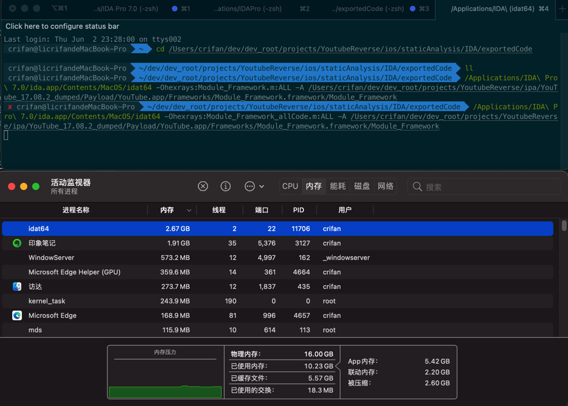
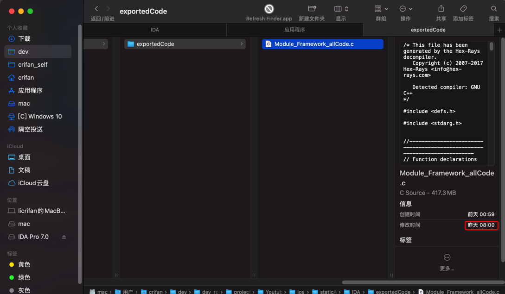
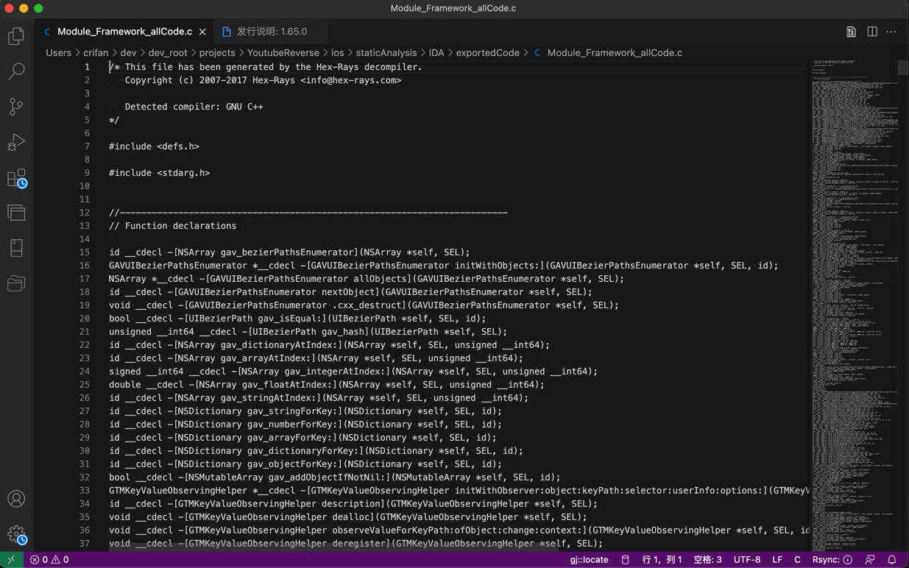
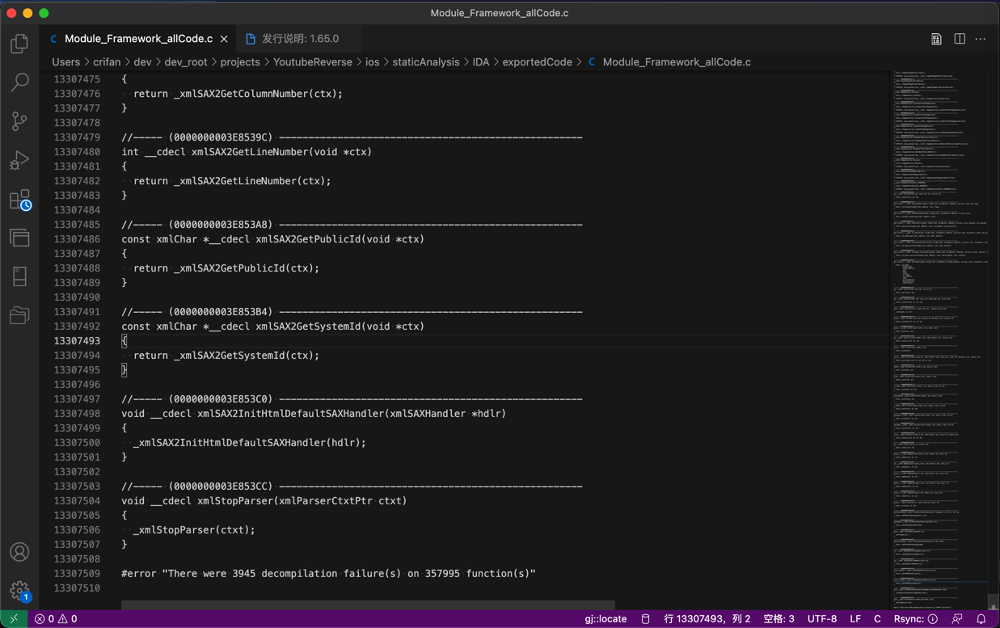
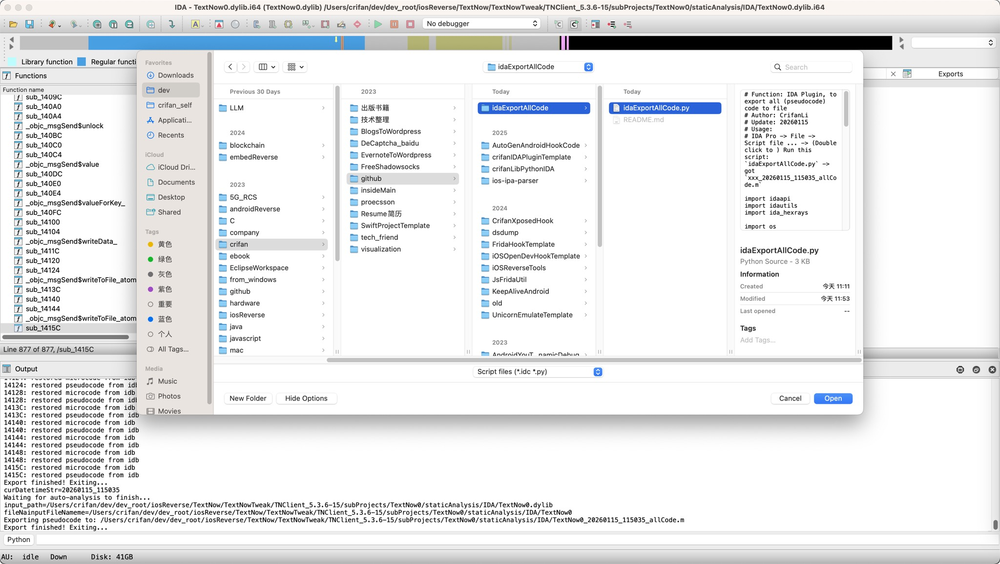
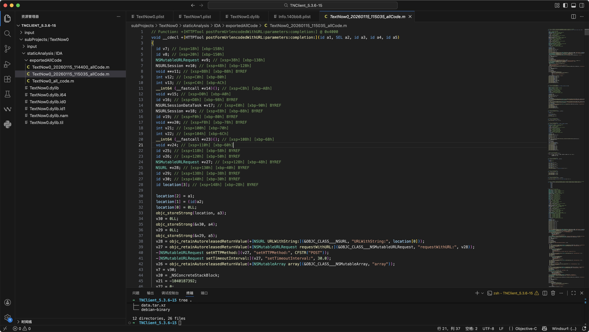
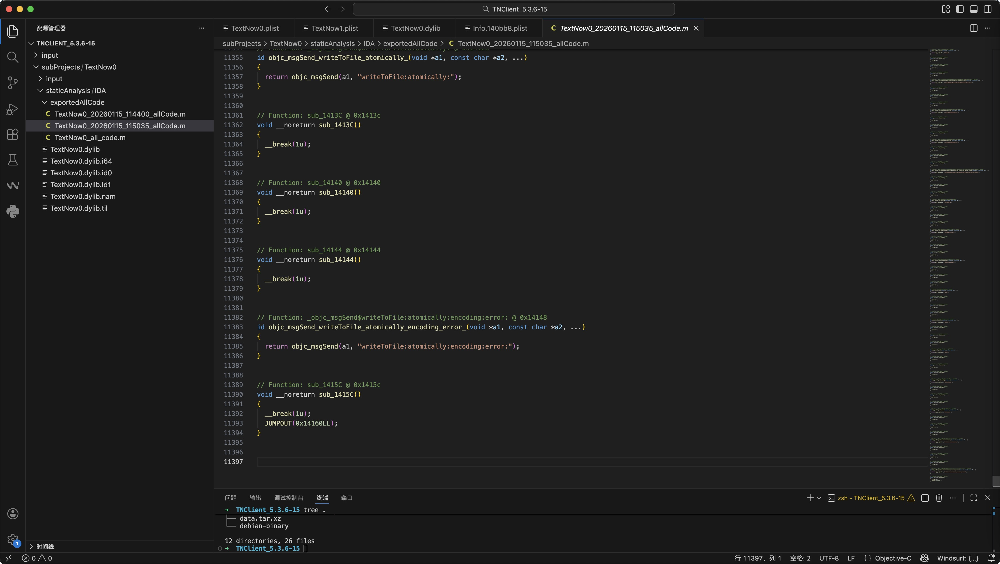

# 导出全部伪代码

IDA中，一般来说，伪代码都是针对单个函数的：反编译再查看单个函数的伪代码。

后来发现，想要导出全部伪代码，也是可以的。

IDA中导出全部伪代码，有2种方式：

* 命令行方式
* IDA插件方式

## 命令行方式导出IDA全部伪代码

命令：

```bash
{IDAT_Path} -Ohexrays:{output_filename}:ALL -A {input_binary_file}

```
  * 参数说明
    * `IDA_Path`
      * 举例
        * `/Applications/IDA\ Pro\ 7.0/ida.app/Contents/MacOS/idat64`
        * `/Applications/IDA\ Professional\ 9.0.app/Contents/MacOS/idat`
    * `input_binary_file`
      * 举例
        * `YouTube.app/Frameworks/Module_Framework.framework/Module_Framework`
        * `TextNow0.dylib`
    * `output_filename`
      * 举例
        * `Module_Framework_allCode.m`
        * `TextNow0Dll_allCode.m`
  * 完整命令举例
    ```bash
    /Applications/IDA\ Pro\ 7.0/ida.app/Contents/MacOS/idat64 -Ohexrays:Module_Framework_allCode.m:ALL -A ../YouTube.app/Frameworks/Module_Framework.framework/Module_Framework

    /Applications/IDA\ Professional\ 9.0.app/Contents/MacOS/idat -Ohexrays:TextNow0Dll_allCode.m:ALL -A ../TextNow0.dylib
    ```

### 举例

#### Module_Framework

命令：

```bash
/Applications/IDA\ Pro\ 7.0/ida.app/Contents/MacOS/idat64 -Ohexrays:Module_Framework_allCode.m:ALL -A /Users/crifan/dev/dev_root/projects/YoutubeReverse/ipa/YouTube_17.08.2_dumped/Payload/YouTube.app/Frameworks/Module_Framework.framework/Module_Framework
```

过程：




输出文件效果：








汇总：

* `Module_Framework`
  * 二进制大小：约120MB
  * IDA导出全部伪代码：
    * 总耗时：约1天
    * 导出文件：`Module_Framework_allCode.c`
      * 代码文件总大小：约420M
      * 总代码行数：1330万行

## IDA插件方式导出IDA全部伪代码

用我整理出来的：

[idaExportAllCode](https://github.com/crifan/idaExportAllCode)中的[idaExportAllCode.py](https://github.com/crifan/idaExportAllCode/blob/main/idaExportAllCode.py)

去从IDA中加载运行该插件`idaExportAllCode.py`，即可导出全部伪代码到本地。

具体详见：

[idaExportAllCode](https://github.com/crifan/idaExportAllCode)

### 举例

#### TextNow0.dylib

IDA中使用该插件：



输出文件效果：




