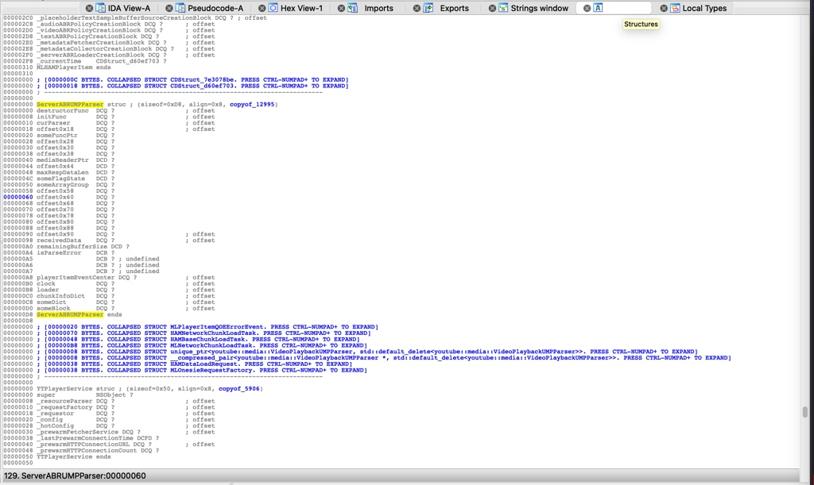
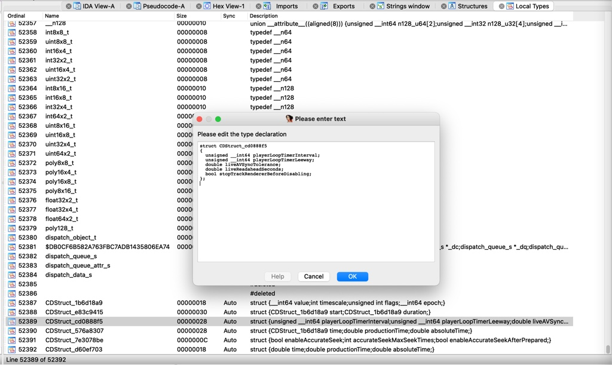
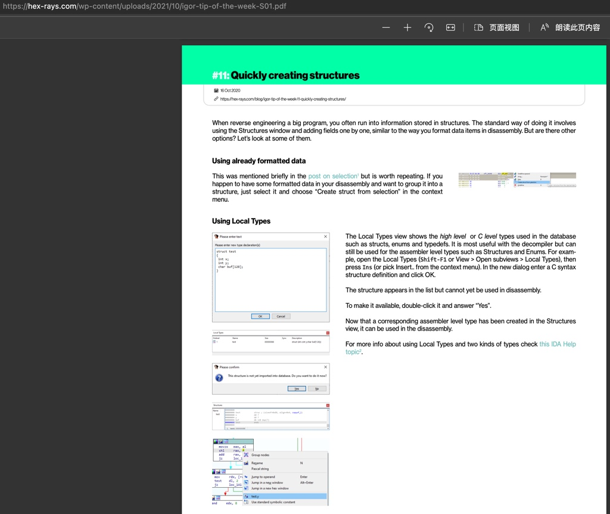

# 结构体定义

TODO：

* 新增Structure结构体定义 + 且双击后，可以导入到数据库中
  * 【已解决】IDA中如何给Local Types中struct MLServerABRLoader加上嵌入的struct结构体定义
* 【整理】iOS逆向心得：IDA使用心得：修改变量类型Set Ivar Type后IDA可以自动解析结构体的属性和字段
* 【整理】IDA使用心得：类的部分字段无法解析，导致伪代码中类的属性错误，需要手动修复结构体定义
* 

---

IDA中，支持把类的原始定义，通过结构体的形式写出来（甚至自动分析出来对应结构体定义），从而后续的汇编代码和伪代码中，自动解析出类的属性和函数的调用，很是方便。

此处的类的结构体定义，主要涉及到两方面：

* `Structures`
  * 
* `Local Types`
  * 

且也支持新增自定义的结构体，更改已有类的结构体的字段定义等，很强大好用的功能。

* 创建结构体
  * 
