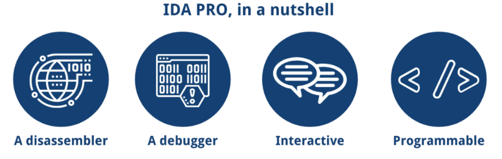
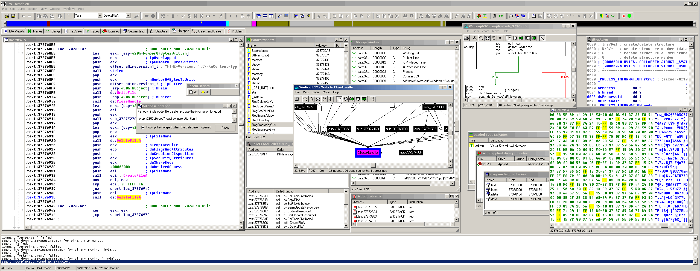
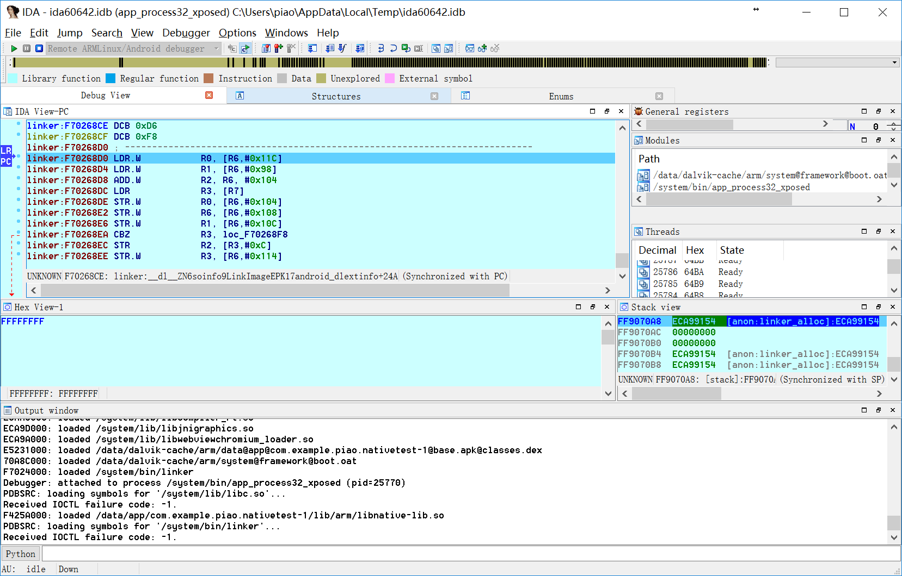

# IDA概览

在逆向领域，有款很功能强大且好用的工具=利器是：`IDA`

* `IDA`
  * 版本和名称
    * 概述：
      * `IDA`有多个版本，功能最强、用的最多最广泛是：`IDA Pro`
        * 所以`IDA Pro`常简称为：`IDA`
    * 详解
      * 后续章节：[版本](../ida_common/version.md)
  * 概述：逆向工程的利器
    * 图
      * 
    * 文字
      * `IDA Pro` – the state-of-the-art binary code analysis solution
      * `IDA Pro` is the flagship product of `Hex-Rays`, the software provider in reverse engineering.
      * Being an interactive and programmable disassembler and debugger, `IDA Pro` provides excellent quality performance on different platforms and is compatible with many processors. `IDA Pro` has become the de-facto standard for the analysis of hostile code, vulnerability research and commercial off-the-shelf validation
  * 常用于
    * iOS逆向
      * 静态分析：逆向二进制，研究代码逻辑
        * 常用功能：函数、F5伪代码、字符串、类的结构体定义等等
      * 动态调试：调试iOS的app
    * Android逆向
      * 支持对Android的静态分析与动态调试
        * 包括：动态调试so文件
  * 特点
    * 支持多平台运行：`Windows`、`Mac`、`Linux`(`CentOS`、`Ubuntu`等)等
    * 支持多种CPU架构：`x86/x64`、`ARM/ARM64`、`MIPS/MIPS64`、`PowerPC/PPC64`、`Motorola 68K/Coldfire`等共**68**种
    * 支持插件，可以扩展各种功能
    * 可编程=支持API接口调用，写脚本，实现各种功能
  * 主页
    * https://hex-rays.com/
      * 关于
        * [IDA: About](https://www.hex-rays.com/products/ida/index.shtml)
      * 下载
        * [IDA Support: Download Center](https://www.hex-rays.com/products/ida/support/download.shtml)
          * 注：`IDA Pro`是商业收费软件，请支持和购买正版
      * 官网截图
        * 
        * 调试安卓dex
          * 
          * 
