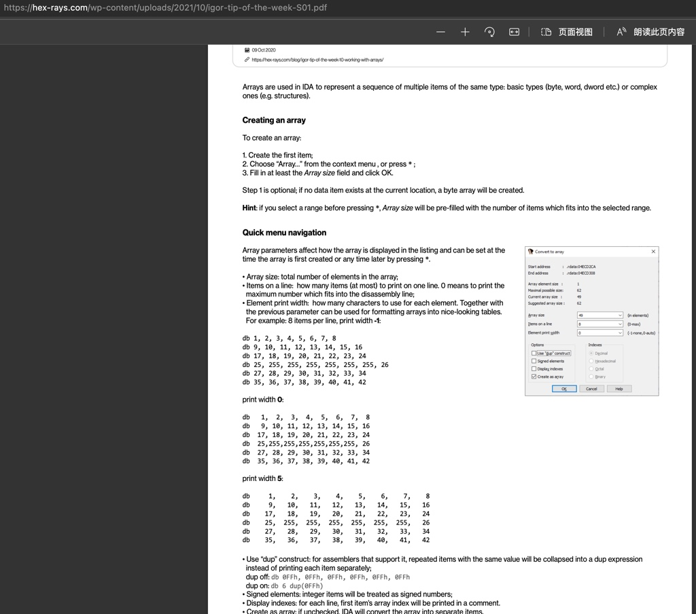

# IDA使用心得

TODO：

* 【记录】IDA Pro使用记录

---

使用IDA逆向分析和调试期间，有很多心得，整理如下，供参考。

## 界面布局

* 【整理】IDA使用心得：把类结构Structures的窗口放在右边方便对比查看

## 代码分析

### 函数跳转

* Jump跳转
  * 【整理】IDA使用心得：根据selector跳转到函数
  * 【整理】IDA使用心得：跳转到历史列表的函数位置

### 函数

* 【整理】IDA使用心得：通过给函数Set Item Type去修正函数的参数的个数和类型和返回值类型

### 类

* 【整理】IDA心得：自定义的类的属性偏移量和自动生成的偏移量不匹配

## bug

* 【整理】IDA使用心得：iOS的ObjC伪代码反编译翻译的有错误不够准确

### 如何处理数组Array

Working with array

