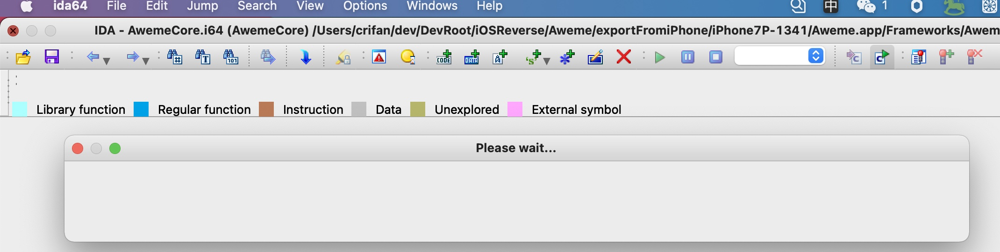
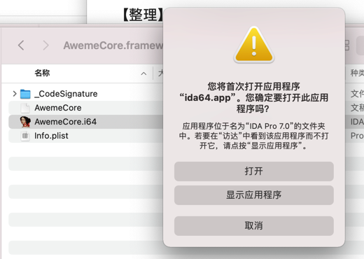
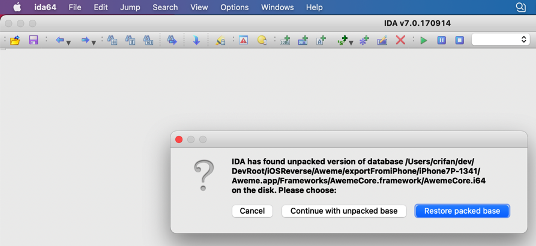
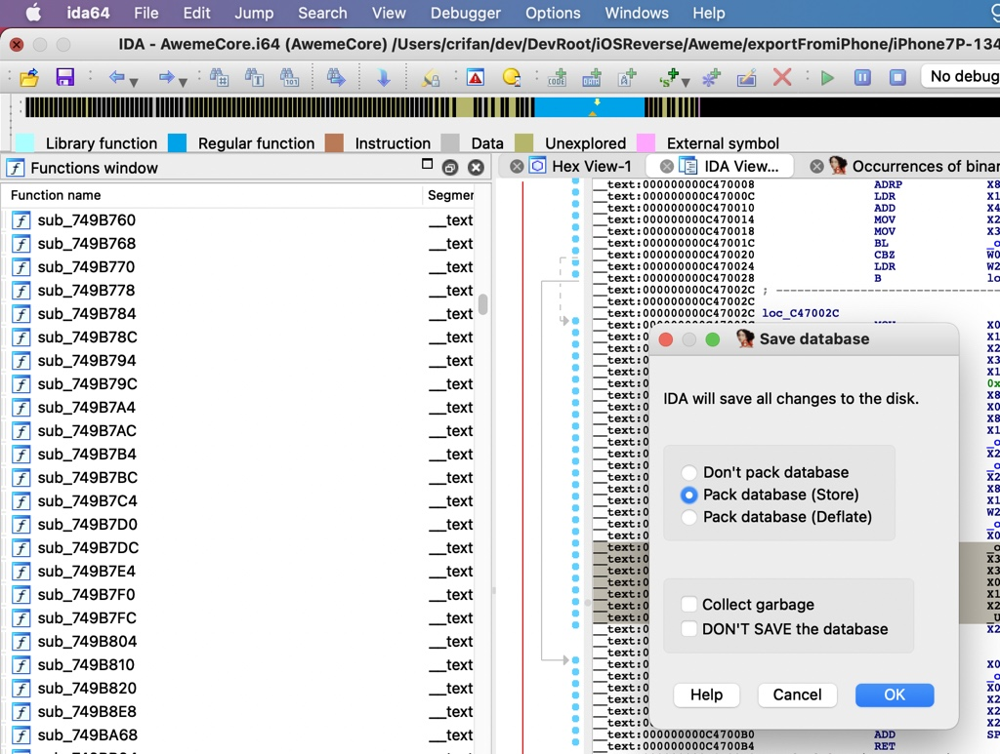
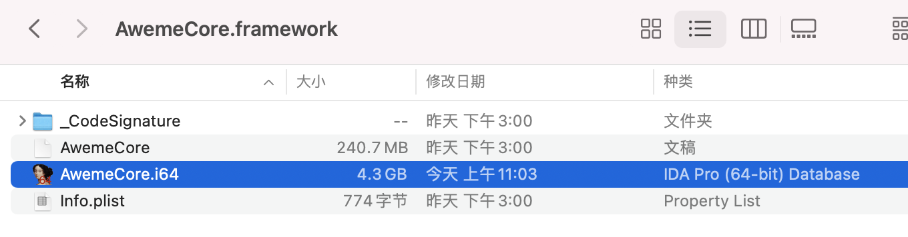
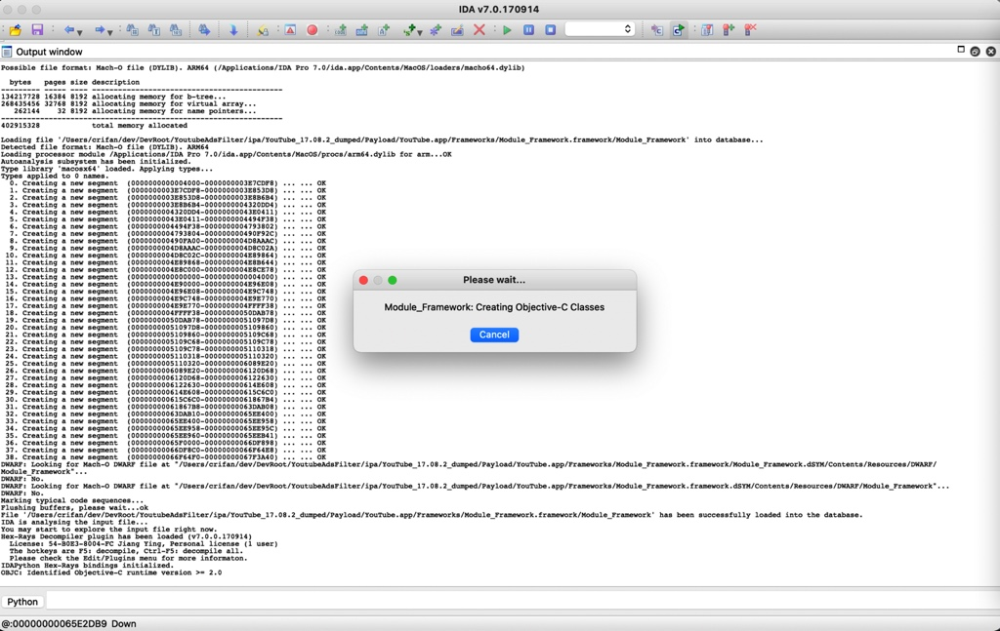

# IDA使用心得

TODO：

* 【记录】IDA Pro使用记录

---

使用IDA逆向分析和调试期间，有很多心得，整理如下，供参考。

## 打开和关闭

IDA，对于打开比较大（比如100多MB）的二进制的话：

* 打开：
  * 首次打开：需要的解析时间很长
  * 再次打开：也需要点时间（大概几十秒，根据已解析的数据库大小决定）
* 关闭：保存改动，写入数据库，也会耗时较长
  * 所以在关闭时，要有耐心，等正常完成后自动关闭
    * 

### 打开

双击`.i64`文件，可以调用IDA（中的`ida64`）去打开：



即可正常打开。

如果之前没有正常关闭，则会提示：

> IDA has found unpacked version of database on the disk. Please choose:
> 
> * Cancel
> * Continue with unpacked base
> * Restore packed base

一般选：`Restore packed base`



即可。

### 关闭

去点击关闭时，一般会有提示：

> IDA will save all changes to the disk.
>
> * Don't pack database
> * Pack database (Store)
> * Pack database (Deflate)



一般选默认的：`Pack database (Store)`

然后保存出的是单个文件：`.i64`：



#### 关闭的心得

* 没有特殊情况时，**千万不要轻易在关闭时，强制杀掉进程**
  * 否则可能会导致：之前的数据库被损坏，再次打开后，之前分析的数据丢失了
    * 比如自己的优化改动，比如给函数变量重命名等

比如之前自己就遇到过：

折腾：

【未解决】IDA中用idat64的Batch Mode尝试反编译导出YouTube的Module_Framework全部代码伪代码

期间，对于IDA的text mode的导出过程，觉得是卡死了，强制杀掉了IDA进程

再去打开IDA的GUI mode，即正常通过IDA图标双击打开，结果报错了

只好去，删除残留文件，全新的加载打开



## 界面布局

* 【整理】IDA使用心得：把类结构Structures的窗口放在右边方便对比查看

## 代码分析

## `*(_DWORD *)`的含义

```c
v7 = *(_DWORD *)(v7 + 8);
```

==

```c
v7 = *(v7 + 8)
```

==

汇编的：

```nasm
MOV v7, DWORD PTR [v7 + 0x8]
```

含义解释：

v7 is assigned with the value located at address v7+8*sizeof(DWORD). For example, if v7 = 0xabcd0123 then v7 + 8*sizeof(DWORD) = 0xabcd0143. Whatever is located at 0xabcd0143 will be assigned to v7.

### 函数跳转

* Jump跳转
  * 【整理】IDA使用心得：根据selector跳转到函数
  * 【整理】IDA使用心得：跳转到历史列表的函数位置

### 函数

* 【整理】IDA使用心得：通过给函数Set Item Type去修正函数的参数的个数和类型和返回值类型

### 类

* 【整理】IDA心得：自定义的类的属性偏移量和自动生成的偏移量不匹配

## bug

* 【整理】IDA使用心得：iOS的ObjC伪代码反编译翻译的有错误不够准确

### 如何处理数组Array

Working with array


