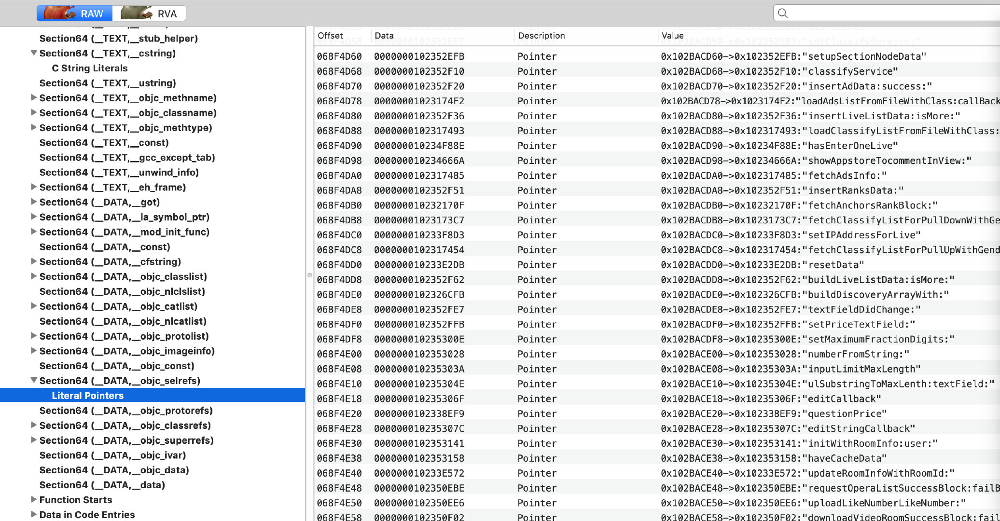
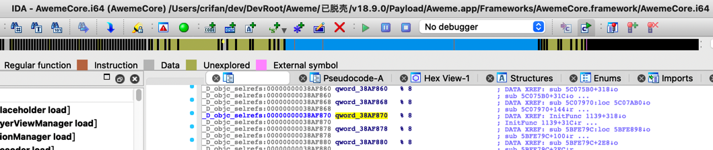
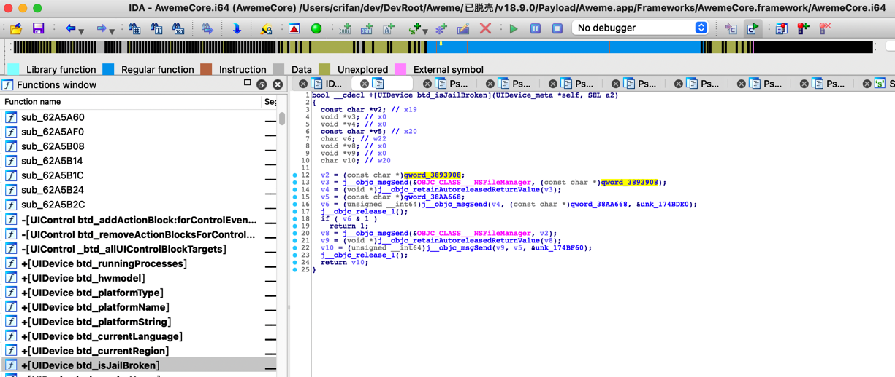
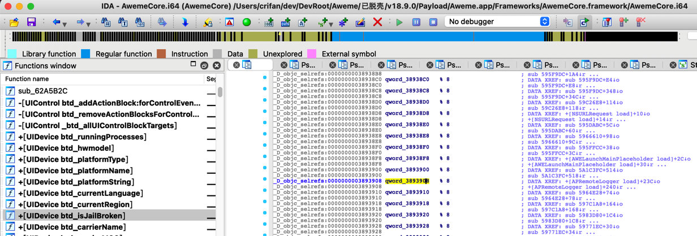
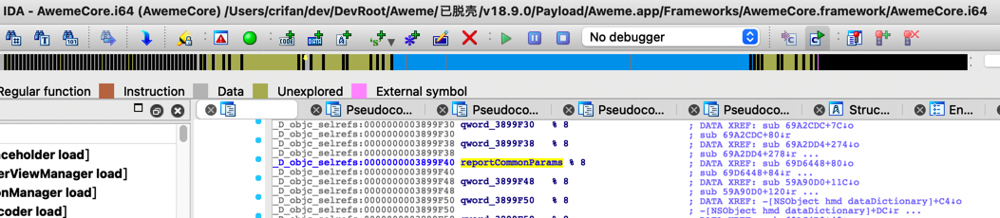

# ObjC

---

TODO：

* 【已解决】研究抖音设备注册逻辑：___lldb_unnamed_symbol580715$$AwemeCore
* 【已解决】iOS逆向心得：如何从对x8的adrp和ldr计算出对应的qword字符串值

---

## 背景知识

* `SectionName`和描述
* `__objc_imageinfo`  记录 Objective-C 环境信息等，dyld 用它来判断镜像是否是 objc 镜像
* `__objc_classlist`  记录镜像所定义的类，每个条目都是一个指针，指向到 __objc_data section
* `__objc_data`    存放真正的类数据，和 __objc_classlist 条目呼应
* `__objc_classname`    类名列表
* `__objc_methodname`    方法名列表
* `__objc_methodtype`    方法类型列表
* `__objc_selrefs`    selector 列表信息，每个条目是指向到 __objc_methname 的指针，记录 selector 的名字
* `__objc_classrefs`    类引用列表
* `__objc_ivar`    类的成员变量列表
* `__objc_const`    存放类的元数据，包括：method list、variable list、property list、class info

->MachOView可以查看二进制的这些段的信息：



## 数据定义含义

### _D_objc_selrefs



```bash
_D_objc_selrefs:00000000038AF870 qword_38AF870   % 8
```

中的含义是：

* `_D_objc_selrefs`
  * ObjC的section段`__objc_selrefs`中的`D`=`Data`=`数据`
* `%`
  * align对齐？
* `8`
  * 以`8`字节对齐？

## 调试出const char* qword是字符串并改名优化定义和伪代码

* 背景

IDA分析抖音AwemeCore时，发现：

伪代码：

)

```c
bool __cdecl +[UIDevice btd_isJailBroken](UIDevice_meta *self, SEL a2)
{
  const char *v2; // x19
  void *v3; // x0
  void *v4; // x0
  const char *v5; // x20
  char v6; // w22
  void *v8; // x0
  void *v9; // x0
  char v10; // w20

  v2 = (const char *)qword_3893908;
  v3 = j__objc_msgSend(&OBJC_CLASS___NSFileManager, (const char *)qword_3893908);
  v4 = (void *)j__objc_retainAutoreleasedReturnValue(v3);
  v5 = (const char *)qword_38AA668;
  v6 = (unsigned __int64)j__objc_msgSend(v4, (const char *)qword_38AA668, &unk_174BDE0);
  j__objc_release_1();
  if ( v6 & 1 )
    return 1;
  v8 = j__objc_msgSend(&OBJC_CLASS___NSFileManager, v2);
  v9 = (void *)j__objc_retainAutoreleasedReturnValue(v8);
  v10 = (unsigned __int64)j__objc_msgSend(v9, v5, &unk_174BF60);
  j__objc_release_1();
  return v10;
}
```

希望知道`qword_3893908`是什么内容，搞懂后，改名，优化伪代码和定义。

* 过程

经过调试：

```bash
(lldb) po (BOOL)[(UIDevice*)0x1dfc62a88 btd_isJailBroken]
2022-03-28 14:55:19.836905+0800 Aweme[39046:2680736] hook_openFile_iOS.xm NSFileManager$fileExistsAtPath$: path=/Applications/Cydia.app -> isJbPath=True -> isExists=False
2022-03-28 14:55:19.838832+0800 Aweme[39046:2680736] hook_openFile_iOS.xm NSFileManager$fileExistsAtPath$: path=/private/var/lib/apt -> isJbPath=True -> isExists=False
```

得知`qword_3893908`应该是其中一个越狱路径字符串

但是IDA中却看不出来，只能看出定义是：

```asm
_D_objc_selrefs:0000000003893908 qword_3893908   % 8                     ; DATA XREF: +[APRemoteLogger load]+23C↓o
_D_objc_selrefs:0000000003893908                                         ; +[APRemoteLogger load]+240↓r ...
```



参考资料地址：

* `dword`
  * 具体的含义，取决于实际情况
    * 指针
    * 指针的指针（地址）
    * 指针的指针的指针
    * 等等
  * 总之就是：
    * `offset dword_XXXX` = `dword_XXXX`的原始地址 = 其指向一个东西 = 具体是啥东西，取决于实际情况
      * 此处抖音`AwemeCore`中，往往是一个字符串
        * 只不过IDA静态分析，看不出具体值
    * qword_xxx
      * 虽然多数情况下是字符串
        * `IDA`伪代码中常见写法：`(char *)qword_xxx`
      * 但是偶尔也有：非字符串的，比如是某个类，比如
        * `<NSRecursiveLock: 0x281d67bf0>{recursion count = 0, name = nil}`
          * IDA伪代码写法：`(void *)qword_56AB210`

后续得知，可以通过调试去打印出具体值：

核心逻辑是：

`qword_xxx`的`xxx`是二进制内偏移量 + 二进制的ALSR = 实际（字符串的）地址

去查看： [ 实际（字符串的）地址 ] = （即可查看到）保存了对应的字符串

举几个例子：

```bash
(lldb) image list -o -f | grep AwemeCore
[  0] 0x0000000104acc000 /Users/crifan/Library/Developer/Xcode/DerivedData/Aweme-fswcidjoxbkibsdwekuzlsfcdqls/Build/Products/Debug-iphoneos/Aweme.app/Frameworks/AwemeCore.framework/AwemeCore

qword_3896270

(lldb) p/x 0x0000000104acc000 + 0x3896270
(long) $15 = 0x0000000108362270
(lldb) x/1gx 0x0000000108362270
0x108362270: 0x0000000105859bc6
(lldb) po (char*)0x0000000105859bc6
"onTheFlyParameter"
—》
qword_3896270 = "onTheFlyParameter"


qword_38B2148
(lldb) p/x 0x0000000104acc000 + 0x38B2148
(long) $17 = 0x000000010837e148
(lldb) x/1gx 0x000000010837e148
0x10837e148: 0x00000001c5619497
(lldb) po (char*)0x00000001c5619497
"dictionaryWithDictionary:"
-> qword_38B2148 = "dictionaryWithDictionary:"


qword_3925208
(lldb) p/x 0x0000000104acc000 + 0x3925208
(long) $19 = 0x00000001083f1208
(lldb) x/1gx 0x00000001083f1208
0x1083f1208: 0x000000010957bb48
(lldb) po (char*)0x000000010957bb48
"configParams"
->qword_3925208 = "configParams"


qword_38A1D98
(lldb) p/x 0x0000000104acc000 + 0x38A1D98
(long) $21 = 0x000000010836dd98
(lldb) x/1gx 0x000000010836dd98
0x10836dd98: 0x0000000105892952
(lldb) po (char*)0x0000000105892952
"ttinstall_stringValueForKey:"
->qword_38A1D98 = "ttinstall_stringValueForKey:"
```

后续还遇到其他类似例子：

* IDA的伪代码中qword没有char*的强制转换如果是_D_objc_selrefs则也表示是字符串

IDA伪代码中：

```c
    if ( (unsigned int)jmp_objc_msgSend_D523EEC(v0, respondsToSelector_1, qword_3899F40) )
```

虽然`qword_3899F40`前面没有`const char *`或`char *`的强制转换。

但是，看到定义中（修改值后）是：

```asm
_D_objc_selrefs:0000000003899F40 reportCommonParams % 8                  ; DATA XREF: sub_69D6448+80↓o
_D_objc_selrefs:0000000003899F40                                         ; sub_69D6448+84↓r ...
```



即是`objc_selrefs`的类型，即是`ObjC`的函数的自我引用

-》则可以推断出就是：某个类的某个函数名

所以也就是：字符串类型的值

所以此处去计算和转换成`char *`是合理的

所以算出来是：

* `qword_3899F40` -> `0x3899F40`

```bash
(lldb) p/x 0x00000001037b4000 + 0x3899F40
(long) $1 = 0x000000010704df40
(lldb) x/1gx 0x000000010704df40
0x10704df40: 0x00000001045537b4
(lldb) po (char*)0x00000001045537b4
"reportCommonParams"
```

然后再去优化伪代码，改为：

```c
    if ( (unsigned int)jmp_objc_msgSend_D523EEC(v0, respondsToSelector_1, reportCommonParams) )
```

即可。
